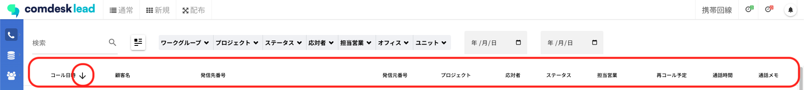

# Comdesk Lead　仕様変更のお知らせ（2023/1/13）

平素より大変お世話になっております。Widsley Supportでございます。\
いつもご利用ありがとうございます。

本日（2023/1/13）夜間リリースにて、Comdesk Leadに下記リリースを実施予定でございます。\
挙動や仕様において、一部変更となる部分がございますので、ご認識いただけますと幸いです。

——————————————————————————–————————————————–———————–——

**・【活動履歴】昇順降順のソート機能を、検索フォームでの絞り込みに仕様変更いたします。**

リリース日時 ： 2023年1月11日(水)  21：00～26：00頃\
※サービスの停止はありません。

——————————————————————————–————————————————–——

以上、ご確認ください。\
ご不明点ございましたら、お気軽に[サポート窓口](https://comdesklead.zendesk.com/hc/ja/requests/new)・担当CSまでご連絡くださいませ。

今後も、より一層みなさまのお役に立てるよう取り組んでまいりますので、引き続き、Comdesk Leadのご愛顧を賜りますよう心よりお願い申し上げます。
