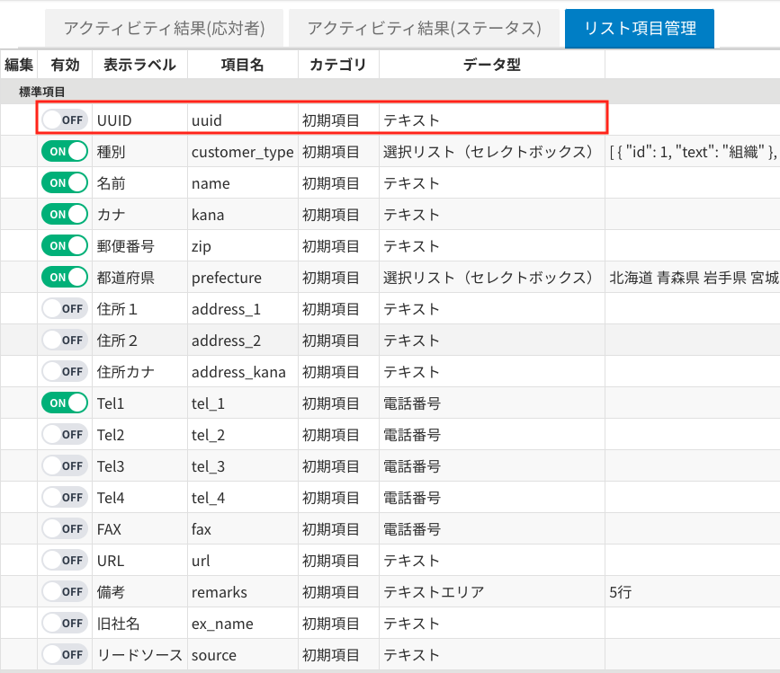
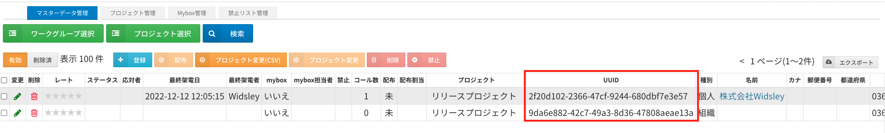
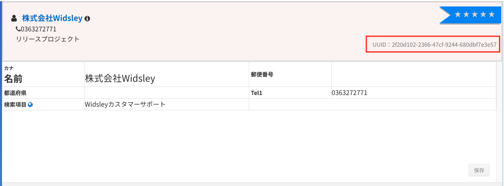
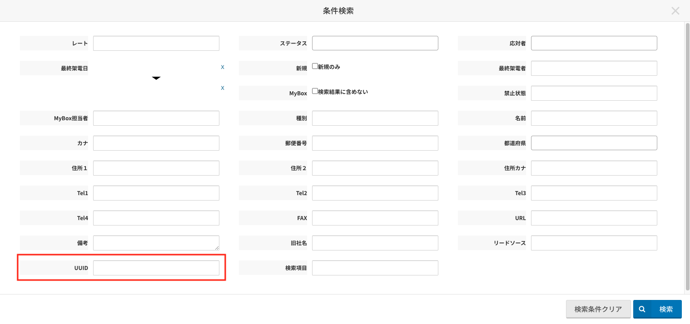

# Comdesk Lead　改修リリースのお知らせ（2023年02月01日）

平素より大変お世話になっております。Widsley Supportでございます。\
いつもご利用ありがとうございます。

本日（2023年02月01日）夜間リリースにて、Comdesk Leadに下記リリースを実施予定でございます。\
挙動や仕様において、一部変更となる部分がございますので、ご認識いただけますと幸いです。

——————————————————————————–————————————————–———————–——

・【マスターデータ管理・コール画面】リスト項目の標準項目にUUIDを追加

——————————————————————————–————————————————–———————–——

詳細は以下のとおりです。

◆【マスターデータ管理・コール画面】リスト項目の標準項目にUUIDを追加\
　　　┗リスト項目設定の標準項目に「UUID」を追加いたしました。\
　　　　　　これにより、マスターデータ管理・コール画面にてUUIDの確認・検索が行えるようになりました。

＜リスト項目設定の画面＞\

＜マスターデータ管理からの確認＞\

＜コール画面からの確認＞\

＜マスターデータ管理・コール画面からの検索＞\

——————————————————————————–————————————————–——

リリース日時 ： 2023年02月01日(水)  21：00～26：00頃\
※サービスの停止はありません。

——————————————————————————–————————————————–——

以上、ご確認ください。\
ご不明点ございましたら、お気軽に\*\*[サポート窓口](https://comdesklead.zendesk.com/hc/ja/requests/new)\*\*・弊社担当者までご連絡くださいませ。

今後も、より一層みなさまのお役に立てるよう取り組んでまいりますので、引き続き、Comdesk Leadのご愛顧を賜りますよう心よりお願い申し上げます。
