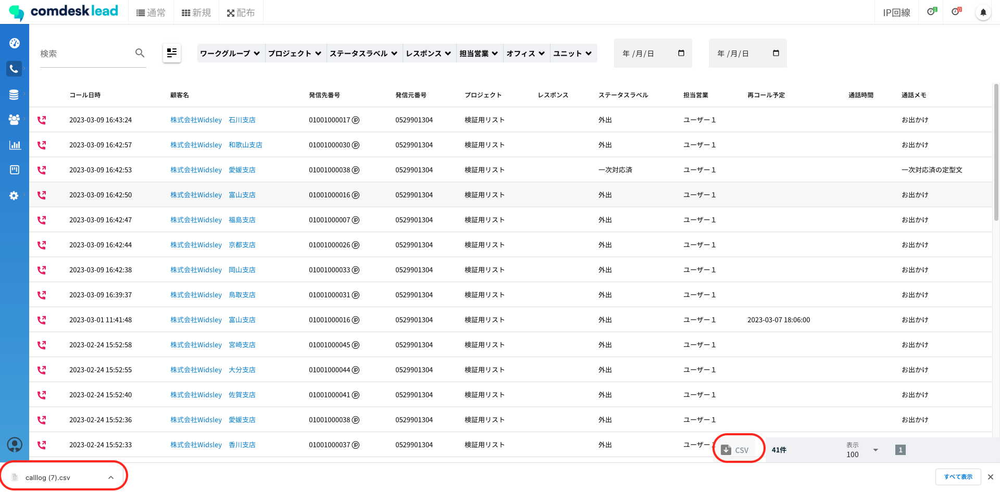
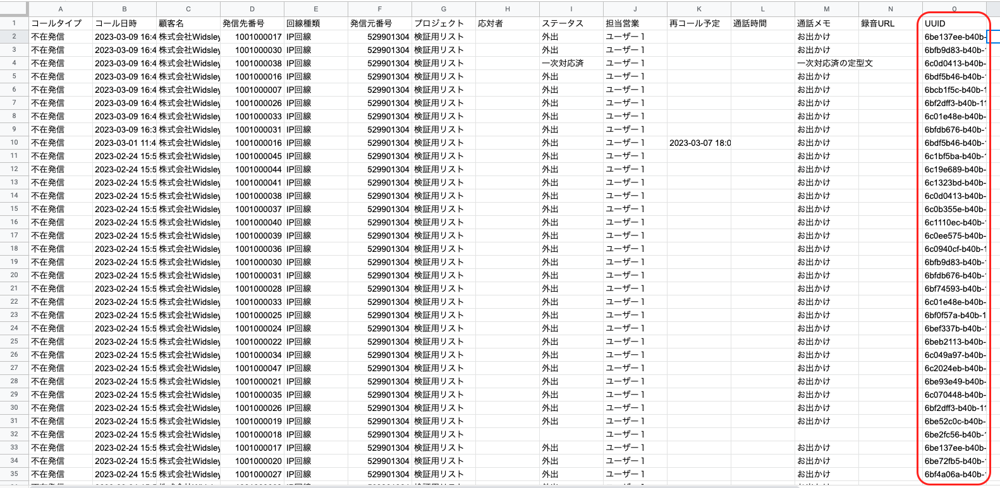
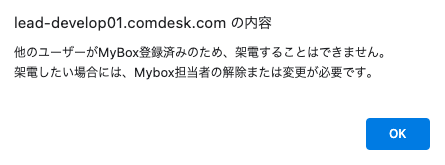
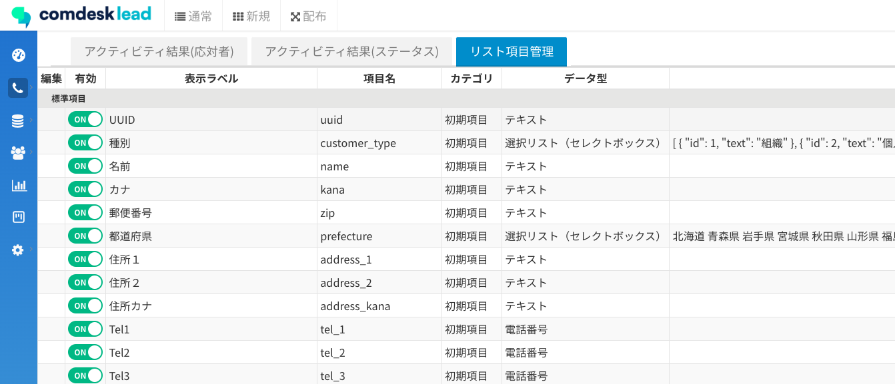
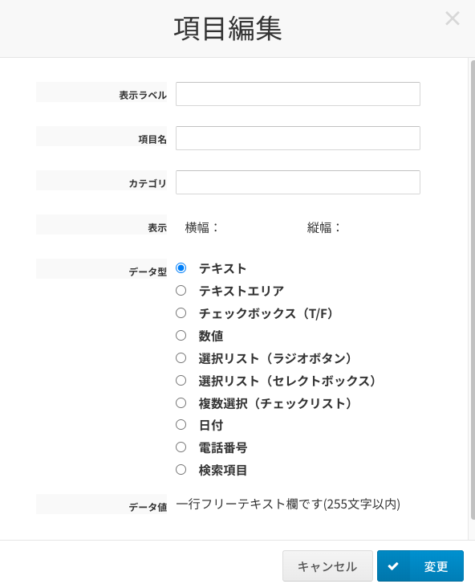

平素より大変お世話になっております。Widsley Customer Supportでございます。\
いつもご利用ありがとうございます。

本日（2023年03月15日）夜間リリースにて、Comdesk Leadに下記リリースを実施予定でございます。\
挙動や仕様において、一部変更となる部分がございますので、ご認識いただけますと幸いです。

——————————————————————————–————————————————–———————–——

・【活動履歴】CSVエクスポート時にUUIDを表示させる機能追加\
・【コール画面】他ユーザーのMyboxに登録されているリストに架電しようとした際、アラート表示される機能追加\
・【プロジェクト管理】配布件数に削除済みリストがカウントされないよう仕様変更\
・【Mybox管理】担当変更を行った際、顧客情報が編集できなくなる事象の解消

・【リスト項目設定】項目の表示ズレを修正\
・【ヒストリー】最後に架電したヒストリーを削除した場合、レポートやマスターデータ管理に反映されるよう改修

——————————————————————————–————————————————–———————–——

詳細は以下のとおりです。

◆【活動履歴】CSVエクスポート時にUUIDを表示させる機能追加\
　　　┗活動履歴にてCSVエクスポートを行うと、CSVの最右列にUUIDを表示される機能追加を実施いたしました。

①活動履歴からCSVエクスポートを行い、CSVファイルを開きます。\

②最右列にUUIDが表示されます。\

◆【コール画面】他ユーザーのMyboxに登録されているリストに架電しようとした際、アラート表示される機能追加\
　　　┗他ユーザーのMyboxに登録されているリストに架電しようとした際、架電不可であることを示すアラートが表示される機能追加を実施いたしました。\

◆【プロジェクト管理】配布件数に削除済みリストがカウントされないよう仕様変更\
　　　┗配布済みのリストを削除してもプロジェクト管理画面の「配布件数」にカウントされていたため、カウントされないよう仕様変更を実施いたしました。

◆【Mybox管理】担当変更を行った際、顧客情報が編集できなくなる事象の解消\
　　　┗Mybox管理からMybox担当変更を行うと、変更を行ったリストで顧客情報を編集できない事象について改修を実施いたしました。

◆【リスト項目設定】項目の表示を修正\
　　　┗表示ラベル・項目名の表示順序および名称がリスト項目一覧画面と追加/編集画面で異なっていたため修正しました。\

◆【ヒストリー】最後に架電したヒストリーを削除した場合、マスターデータ管理やレポートに反映されるよう改修\
　　　┗最後に架電したヒストリーを削除した場合の挙動改修を実施いたしました。\
　　　　　　マスターデータ管理：直前の架電ヒストリー（応対者・ステータス・最終架電日時）が表示\
　　　　　　レポート：最後に架電したヒストリーを削除した場合に、レポートへも反映

——————————————————————————–————————————————–——

リリース日時 ： 2023年03月15日(水)  21：00～26：00頃\
※サービスの停止はありません。

——————————————————————————–————————————————–——

以上、ご確認ください。\
ご不明点ございましたら、お気軽に\*\*[サポート窓口](https://comdesklead.zendesk.com/hc/ja/requests/new)\*\*・弊社担当者までご連絡くださいませ。

今後も、より一層みなさまのお役に立てるよう取り組んでまいりますので、引き続き、Comdesk Leadのご愛顧を賜りますよう心よりお願い申し上げます。
