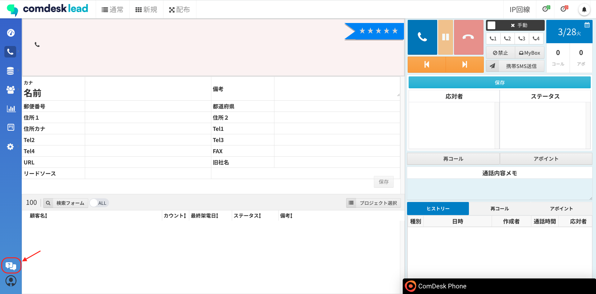
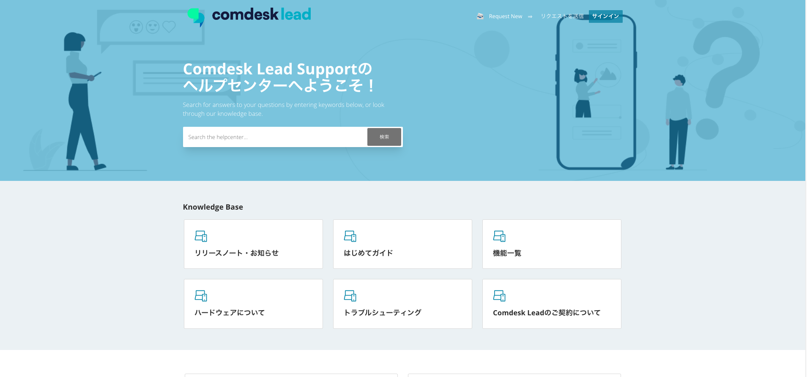
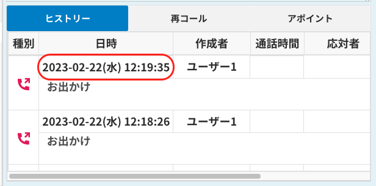

平素より大変お世話になっております。Widsley Customer Supportでございます。\
いつもご利用ありがとうございます。

本日（2023年03月29日）夜間リリースにて、Comdesk Leadに下記リリースを実施予定でございます。\
挙動や仕様において、一部変更となる部分がございますので、ご認識いただけますと幸いです。

——————————————————————————–————————————————–———————–——

・【全体】画面左下にヘルプセンターへアクセスできるアイコン追加\
・【ユーザー管理】ユーザー氏名・パスワード・ユーザー種別・プロフィール画像（​​写真ファイル）\
・【プロフィール】パスワード・プロフィール画像（写真ファイル）の編集機能を追加\
・【ヒストリー】年月日表示箇所へ曜日の追加\
・【再コールリスト】デフォルトの表示件数を10件→50件へ変更

——————————————————————————–————————————————–———————–——

詳細は以下のとおりです。

◆【全体】画面左下にヘルプセンターへアクセスできるアイコン追加\
　　　┗アイコンをクリックすることで、弊社ヘルプセンターへクイックにアクセスすることが可能になりました。

①アイコンをクリックします。\

②ヘルプセンターが表示されます。\
[https://comdesklead.zendesk.com/hc/ja](https://comdesklead.zendesk.com/hc/ja)\

◆【ユーザー管理】ユーザー氏名・パスワード・ユーザー種別・プロフィール画像（写真ファイル）の編集機能を追加\
　　　┗システム管理者・マネージャー権限のユーザーであれば、ユーザー管理より下記項目が編集可能となりました。\
　　　　　　・ユーザー氏名\
　　　　　　・ユーザー種別（「サポート」「退職者」を含む変更は、ご依頼ください。）\
　　　　　　・パスワード\
　　　　　　・プロフィール写真（写真ファイル）

◆【プロフィール】パスワード・プロフィール画像（写真ファイル）の編集機能を追加\
　　　┗画面左下のアイコンをクリックし、プロフィールを選択後の画面にて下記項目が編集可能となりました。\
　　　　　　・パスワード\
　　　　　　・プロフィール写真（写真ファイル）

◆【ヒストリー】年月日表示箇所へ曜日の追加\
　　　┗ヒストリーに表示されている年月日表示箇所へ、曜日の追加を実施いたしました。\

◆【再コールリスト】デフォルトの表示件数を10件→50件へ変更\
　　　┗再コールリストで表示されるデフォルト件数を10件→50件へ変更いたしました。\
　　　　　　なお、任意で選択できる表示件数はこれまで通り「10件」「25件」「50件」「100件」となります。

——————————————————————————–————————————————–——

リリース日時 ： 2023年03月29日(水)  21：00～26：00頃\
※サービスの停止はありません。

——————————————————————————–————————————————–——

以上、ご確認ください。\
ご不明点ございましたら、お気軽に\*\*[サポート窓口](https://comdesklead.zendesk.com/hc/ja/requests/new)\*\*・弊社担当者までご連絡くださいませ。

今後も、より一層みなさまのお役に立てるよう取り組んでまいりますので、引き続き、Comdesk Leadのご愛顧を賜りますよう心よりお願い申し上げます。
