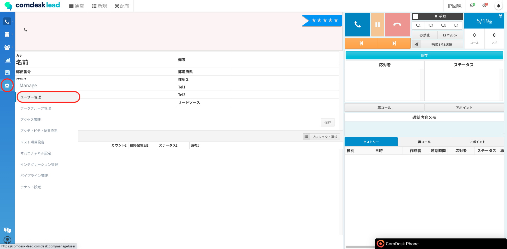
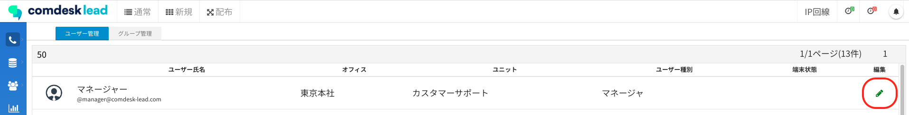
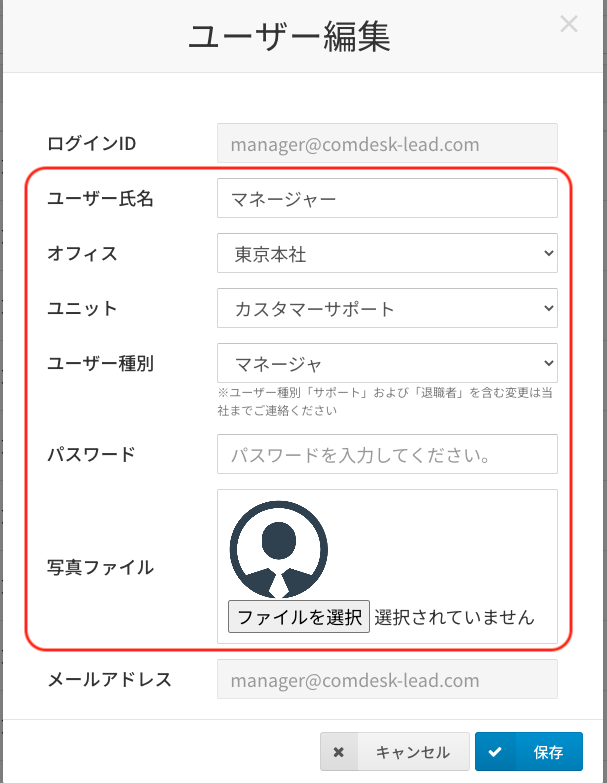
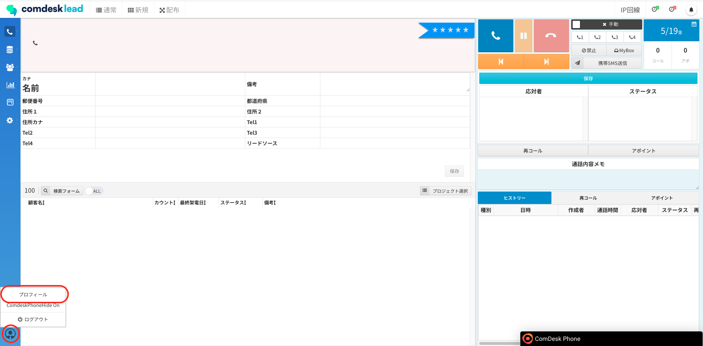
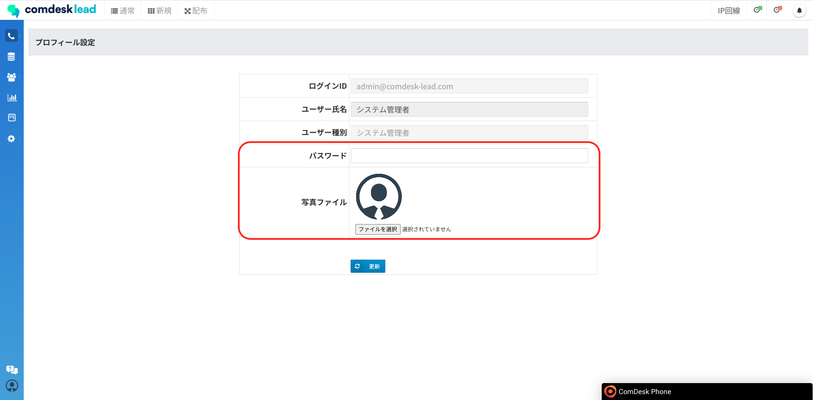

平素より大変お世話になっております。Widsley Customer Supportでございます。\
いつもご利用ありがとうございます。

昨日（2023年05月18日）夜間リリースにて、Comdesk Leadに下記リリースを実施いたしました。

なお、今回リリースさせていただきましたのは、2023年03月29日のリリースにて不具合が発生した機能について再度修正した内容となっております。

その折はご不便をおかけし、大変申し訳ございませんでした。

挙動や仕様について、一部変更となる部分がございますので、ご認識いただけますと幸いです。

——————————————————————————–————————————————–———————–——

・【ユーザー管理】ユーザー氏名・パスワード・ユーザー種別・プロフィール画像（​​写真ファイル）\
・【プロフィール】パスワード・プロフィール画像（写真ファイル）の編集機能を追加

——————————————————————————–————————————————–———————–——

詳細は以下のとおりです。

◆【ユーザー管理】ユーザー氏名・パスワード・ユーザー種別・プロフィール画像（写真ファイル）の編集機能を追加\
　　　┗システム管理者・マネージャー権限のユーザーであれば、ユーザー管理より下記項目が編集可能となりました。\
　　　　　　・ユーザー氏名\
　　　　　　・ユーザー種別（「サポート」「退職者」を含む変更は、ご依頼ください。）\
　　　　　　・パスワード\
　　　　　　・プロフィール写真（写真ファイル）

＜編集手順＞\
①「ユーザー管理」をクリック\

②編集したいユーザーの編集ボタンをクリック\

③編集したい項目を編集し、「保存」をクリック\

◆【プロフィール】パスワード・プロフィール画像（写真ファイル）の編集機能を追加\
　　　┗画面左下のアイコンをクリックし、プロフィールを選択後の画面にて下記項目が編集可能となりました。\
　　　　　　・パスワード\
　　　　　　・プロフィール写真（写真ファイル）

＜編集手順＞\
①画面左下のアイコンをクリック後、「プロフィール」をクリック\

②編集したい項目を編集し、「変更」をクリック\

——————————————————————————–————————————————–——

リリース日時 ： 2023年05月18日(水)  21：00～26：00頃\
※サービスの停止はありません。

——————————————————————————–————————————————–——

以上、ご確認ください。\
ご不明点ございましたら、お気軽に\*\*[サポート窓口](https://comdesklead.zendesk.com/hc/ja/requests/new)\*\*・弊社担当者までご連絡くださいませ。

今後も、より一層みなさまのお役に立てるよう取り組んでまいりますので、引き続き、Comdesk Leadのご愛顧を賜りますよう心よりお願い申し上げます。
