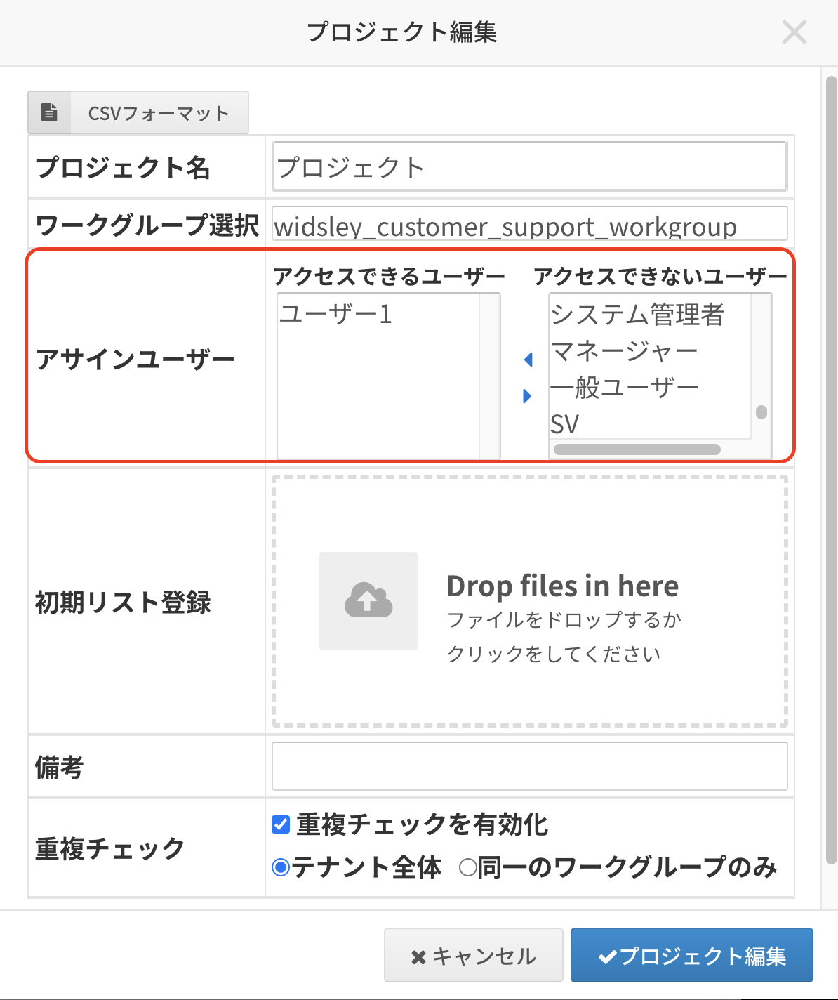
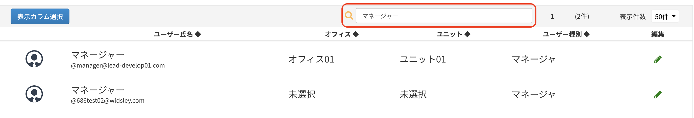
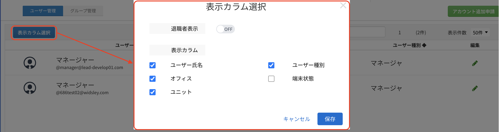

# Comdesk Lead　改修リリースのお知らせ（2023年06月14日）

平素より大変お世話になっております。Widsley Customer Supportでございます。\
いつもご利用ありがとうございます。

本日（2023年06月14日）夜間リリースにて、Comdesk Leadに下記リリースを実施予定でございます。

挙動や仕様について、一部変更となる部分がございますので、ご認識いただけますと幸いです。

——————————————————————————–————————————————–———————–——

・【プロジェクト管理】プロジェクトアサイン画面にて退職者ユーザーは表示されないよう改善\
・【ユーザー管理】ユーザー検索機能を追加\
・【ユーザー管理】表示カラムの選択機能を追加

——————————————————————————–————————————————–———————–——

詳細は以下のとおりです。

◆【プロジェクト管理】プロジェクトアサイン画面にて退職者ユーザーは表示されないよう改善\
　　　┗プロジェクトアサイン時に、退職者ユーザーは表示されず現在有効なユーザーのみ表示されるよう改善しました。\
※退職者ユーザーがすでにプロジェクトにアサインされている場合はそのまま表示されます。\

◆【ユーザー管理】ユーザー検索機能を追加\
　　　┗ユーザー管理画面にて、ユーザー検索機能を追加しました。ユーザー名、ユニット名、オフィス名での検索が可能です。\

◆【ユーザー管理】表示カラムの選択機能を追加\
　　　┗ユーザー管理画面で表示されるカラムを選択できる機能を追加しました。\
　　　　　　併せて、退職者ユーザーの表示/非表示も可能になっております。\

——————————————————————————–————————————————–——

リリース日時 ： 2023年06月14日(水)  21：00～26：00頃\
※サービスの停止はありません。

——————————————————————————–————————————————–——

以上、ご確認ください。\
ご不明点ございましたら、お気軽に\*\*[サポート窓口](https://comdesklead.zendesk.com/hc/ja/requests/new)\*\*・弊社担当者までご連絡くださいませ。

今後も、より一層みなさまのお役に立てるよう取り組んでまいりますので、引き続き、Comdesk Leadのご愛顧を賜りますよう心よりお願い申し上げます。
