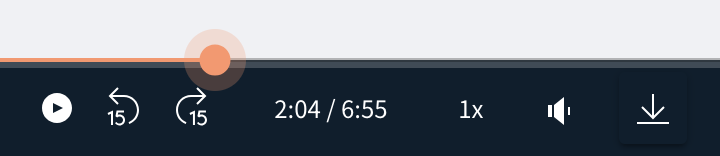

# Comdesk Lead　改修リリースのお知らせ（2023年07月27日）

平素より大変お世話になっております。Widsley Customer Supportでございます。\
いつもご利用ありがとうございます。

本日（2023年07月27日）夜間リリースにて、Comdesk Leadに下記リリースを実施いたしました。

挙動や仕様について、一部変更となる部分がございますので、ご認識いただけますと幸いです。

——————————————————————————–————————————————–———————–——

・【活動履歴】録音再生バーの機能改善

——————————————————————————–————————————————–———————–——

詳細は以下のとおりです。

◆【活動履歴】録音再生バーの機能改善\
　　　┗再生バーを移動させることで、任意の時間から録音再生することが可能となりました。\

——————————————————————————–————————————————–——

リリース日時 ： 2023年07月27日(水)  21：00～26：00頃\
※サービスの停止はありません。

——————————————————————————–————————————————–——

以上、ご確認ください。\
ご不明点ございましたら、お気軽に\*\*[サポート窓口](https://comdesklead.zendesk.com/hc/ja/requests/new)\*\*・弊社担当者までご連絡くださいませ。

今後も、より一層みなさまのお役に立てるよう取り組んでまいりますので、引き続き、Comdesk Leadのご愛顧を賜りますよう心よりお願い申し上げます。
