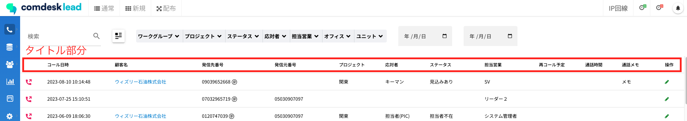

平素より大変お世話になっております。Widsley Customer Supportでございます。\
いつもご利用ありがとうございます。

本日（2023年08月23日）夜間リリースにて、Comdesk Leadに下記リリースを実施予定でございます。

挙動や仕様について、一部変更となる部分がございますので、ご認識いただけますと幸いです。

——————————————————————————–————————————————–———————–——

・【活動履歴】録音再生バーの挙動改善\
・【活動履歴】活動履歴上部のタイトル部分の固定化\
・【マスターデータ管理・新規コールモード】アサインされていないプロジェクトが閲覧できてしまう事象の改善

——————————————————————————–————————————————–———————–——

詳細は以下のとおりです。

◆【活動履歴】録音再生バーの挙動改善\
　　　┗録音再生バーで任意の位置からの再生が可能となり、また再生位置を変更した際のバーの挙動も改善いたしました。

◆【活動履歴】活動履歴上部のタイトル部分の固定化\
　　　┗画面を下にスクロールしてもタイトル部分が表示されるよう固定化を実施いたしました。\

◆【マスターデータ管理・新規コールモード】アサインされていないプロジェクトが閲覧できてしまう事象の改善\
　　　┗マスターデータ管理・新規コールモードそれぞれの変更は、以下の通りです。

【マスターデータ管理画面】\
システム管理者：自分がアサインされていないプロジェクトはマスターデータ管理画面で閲覧できる、顧客登録できる\
マネージャー：自分がアサインされていないプロジェクトはマスターデータ管理画面で閲覧できる、顧客登録できない\
SV：自分がアサインされていないプロジェクトはマスターデータ管理画面で閲覧できない、顧客登録できない\
リーダー：自分がアサインされていないプロジェクトはマスターデータ管理画面で閲覧できない、顧客登録できない\
一般ユーザー：自分がアサインされていないプロジェクトはマスターデータ管理画面で閲覧できない、顧客登録できない

【新規コールモード】\
システム管理者：自分がアサインされていないプロジェクトの電話番号でも検索・表示・架電できる\
システム管理者以外：自分がアサインされていないプロジェクトの電話番号は検索・表示できない

——————————————————————————–————————————————–——

リリース日時 ： 2023年08月23日(水)  21：00～26：00頃\
※サービスの停止はありません。

——————————————————————————–————————————————–——

以上、ご確認ください。\
ご不明点ございましたら、お気軽に\*\*[サポート窓口](https://comdesklead.zendesk.com/hc/ja/requests/new)\*\*・弊社担当者までご連絡くださいませ。

今後も、より一層みなさまのお役に立てるよう取り組んでまいりますので、引き続き、Comdesk Leadのご愛顧を賜りますよう心よりお願い申し上げます。
