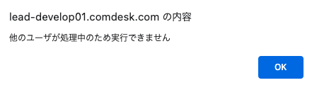

平素より大変お世話になっております。Widsley Customer Supportでございます。\
いつもご利用ありがとうございます。

本日（2023年09月20日）夜間リリースにて、Comdesk Leadに下記リリースを実施予定でございます。

挙動や仕様について、一部変更となる部分がございますので、ご認識いただけますと幸いです。

——————————————————————————–————————————————–———————–——

・【マスターデータ管理】一括禁止登録を複数同時に実施した際のアラート表示機能追加

——————————————————————————–————————————————–———————–——

詳細は以下のとおりです。

◆【マスターデータ管理】一括禁止登録を複数同時に実施した際のアラート機能追加\
　　　┗一括禁止登録を実行した際、同時に他のユーザーが一括禁止登録を実行していた場合には\
　　　　　「他のユーザーが処理中のため実行できません」というアラート表示がされるよう機能追加いたしました。\

——————————————————————————–————————————————–——

リリース日時 ： 2023年09月20日(水)  21：00～26：00頃\
※サービスの停止はありません。

——————————————————————————–————————————————–——

以上、ご確認ください。\
ご不明点ございましたら、お気軽に\*\*[サポート窓口](https://comdesklead.zendesk.com/hc/ja/requests/new)\*\*・弊社担当者までご連絡くださいませ。

今後も、より一層みなさまのお役に立てるよう取り組んでまいりますので、引き続き、Comdesk Leadのご愛顧を賜りますよう心よりお願い申し上げます。
