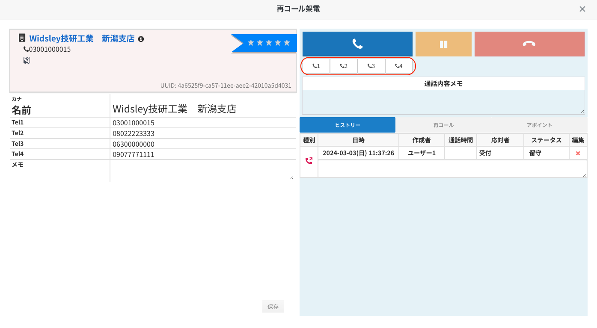

# 2024/03/06　アップデート予定の機能について

2024年03月06日夜間リリースにて、Comdesk Leadの一部機能をアップデート予定でございます。

挙動や仕様において、一部変更となる部分がございますので、ご認識いただけますと幸いです。

[重複チェック項目の選択が可能に！](29474705876121_2024_03_06_アップデート予定の機能について.md)\
[再コール機能における「tel1」〜「tel4」いずれかの番号で発信が可能に！](29474705876121_2024_03_06_アップデート予定の機能について.md)

## **重複チェック項目の選択が可能に！**

「プロジェクト登録」/「プロジェクト編集」において重複チェック有効時、以下の3項目より選択が可能になります。

* 名前
* 電話番号
* 名前または電話番号

※「名前」を選択した場合、完全一致で重複対象となります。

※あくまでも重複チェック時における対象項目の選択となり、禁止番号は現状同様テナント設定に準ずる。

詳細は[こちら](29515736722585_重複チェック項目の選択が可能に（アップデート後）.md)をご確認ください。

## **再コール機能における「tel1」〜「tel4」いずれかの番号で発信が可能に！**

再コールのダイアログから発信時、

「tel1」〜「tel4」いずれかの番号を選択し発信が可能になります。

※「tel1」〜「tel4」いずれも選択していない場合は、「tel1」へ発信されます。

——————————————————————————–————————————————–——

リリース日時 ： 2024年03月06日(水)  21：00～26：00頃

※サービスの停止はありません。

——————————————————————————–————————————————–——

その他ご不明点などございましたら、[**サポートチームまでお問い合わせ**](https://comdesklead.zendesk.com/hc/ja/requests/new)をお願い致します。

お問い合わせ方法は\*\*[こちら](../../トラブルシューティング/サポートチームへのお問い合わせ方法/12828937533081_サポートチームへのお問い合わせ方法.md)\*\*
