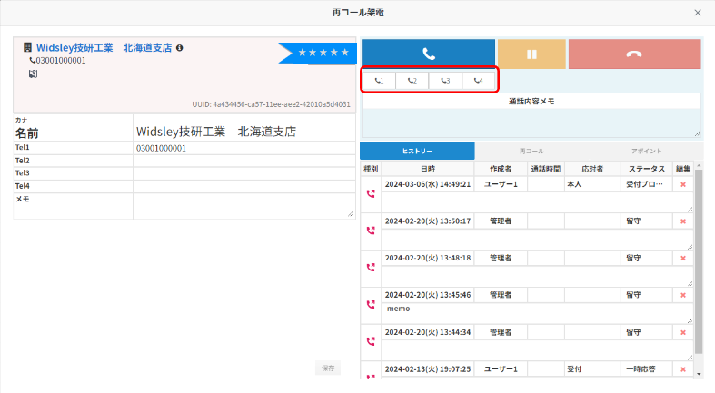
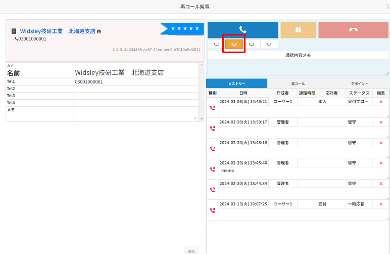

**再コールポップアップ表示時の再コール**

tel1のみ発信可能だった、再コールのダイアログ内で発信先をtel1.2.3.4と選択できるようになりました。

※デフォルトでは「tel1」に設定されています。

発信先選択後、発信ボタンを押すと選択した発信先に架電可能です。

選択されているものは赤枠内のようにオレンジ色に切り替わります。

再コール手順に関しては変わらず、

1. 再コール設定行う
2. 再コールポップアップが時間になると表示される
3. 再コールポップアップ内「再コール」押すと再コール時のダイアログが表示される
4. リストに遷移することなく架電が可能
5. 発信ボタン押下で再コール
6. 通話が終了したら切電ボタンをクリックし、再コール完了後は再コール通話内容記録が必須
7. 必要情報を入力後、「保存して再コール終了」をクリックすると再コール完了

参考記事：再コール設定したリストへの再コール（アップデート後）
