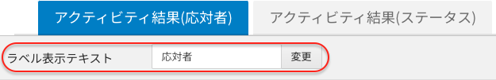

平素より大変お世話になっております。Widsley Customer Supportでございます。

いつもComdesk Leadのご利用いただき、誠にありがとうございます。

2024年04月03日夜間にて、Comdesk Leadの一部機能を改修リリースを実施いたします。

挙動や仕様において、一部変更となる部分がございますので、ご認識いただけますと幸いです。

——————————————————————————–————————————————–———————–——

・【マスターデータ管理】\
マスターデータ管理 から顧客名を選択し顧客詳細画面に遷移した際、右下ヒストリーが縦スクロールできない不具合を改善

・【アクティビティ結果設定】\
応対者/ステータスで表示している「ラベル表示テキスト」を変更しても、反映されない不具合の改善

・【コール画面】\
コール画面において再コールダイアログからのコール時、架電先（tel1\~tel4）を指定せず発信アイコンをクリックした場合\
「番号がありません」とポップアップが表示され、発信ができない不具合を改善

——————————————————————————–————————————————–———————–——

リリース日時 ： 2024年04月03日(水) 21：00～26：00頃\
※サービスの停止はありません。

——————————————————————————–————————————————–———————–——

その他ご不明点・ご意見などございましたら、[サポートチームまで](https://comdesklead.zendesk.com/hc/ja/requests/new)お問い合わせをお願いいたします。\
　→お問い合わせ方法は[こちら](../../トラブルシューティング/サポートチームへのお問い合わせ方法/12828937533081_サポートチームへのお問い合わせ方法.md) （初めてのお問い合わせ方法は[こちら](../../トラブルシューティング/サポートチームへのお問い合わせ方法/12927370479257_はじめてのサポートチームへのお問い合わせ方法.md)）

今後も、より一層みなさまのお役に立てるよう取り組んでまいりますので\
引き続き、Comdesk Leadのご愛顧を賜りますよう心よりお願い申し上げます。
