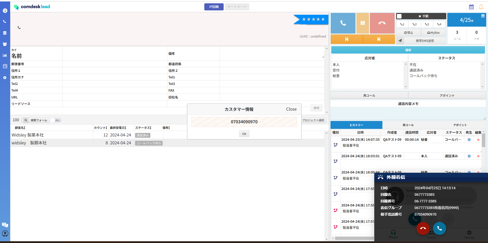
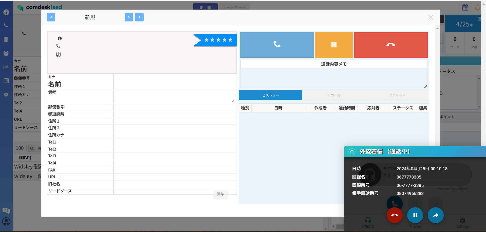
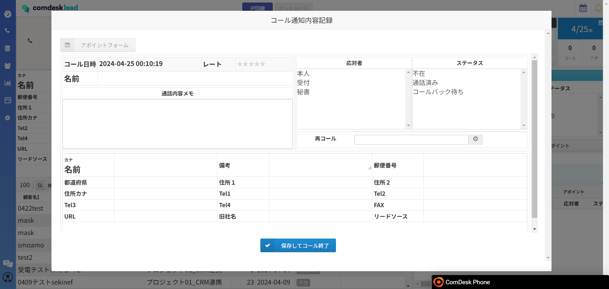

# IP回線利用時の受電について（リスト登録なし）

※受電専用ダイアログ内で顧客情報の登録はできない仕様です。※

　通話内容記録保存後に新規でリスト登録していただくようになりました。

「新規コールモードから新規リストとして追加」

┗記事なさそうなので、手順追記必要？

「リストインポートで新規リストとして追加」

[../../はじめてガイド/管理者ガイド/12743928066585\_リストをプロジェクトにインポート.md](../../はじめてガイド/管理者ガイド/12743928066585_リストをプロジェクトにインポート.md)

【表示される順（受電方法）】

※カスタマー情報ダイアログ表示➡受電専用ダイアログ➡通話内容記録ポップアップ※

登録されてないリスト?番号

\[番号確認：カスタマー情報ダイアログ]

①着信のあった電話番号のみ表示されます。

「OK」クリックで受電専用ダイアログが表示されます。

\[通話時：受電専用ダイアログ]

* 青色：受電ボタンクリックで通話が開始されます。
* 通話内容メモにのみ入力及び保存が可能です。
* ダイアログ内左側に顧客情報欄がございますが、入力はできない状態になっております。

\[切電後：通話内容記録ポップアップ]

* 初期ワークグループの応対者、ステータスが保存可能になります。
* ポップアップ内、顧客情報欄が表示されていますが入力はできません。（形式上表示になっております）
* 通話内容メモに受電のあった顧客の情報を入力し、情報に基づいて新規リストトして登録していただきます。

【別顧客から受電が重なった場合】

・一件目の顧客を処理しないと二件目の顧客は表示されません。

・一件目を受電し通話中になると、二件目が表示される仕様です。
