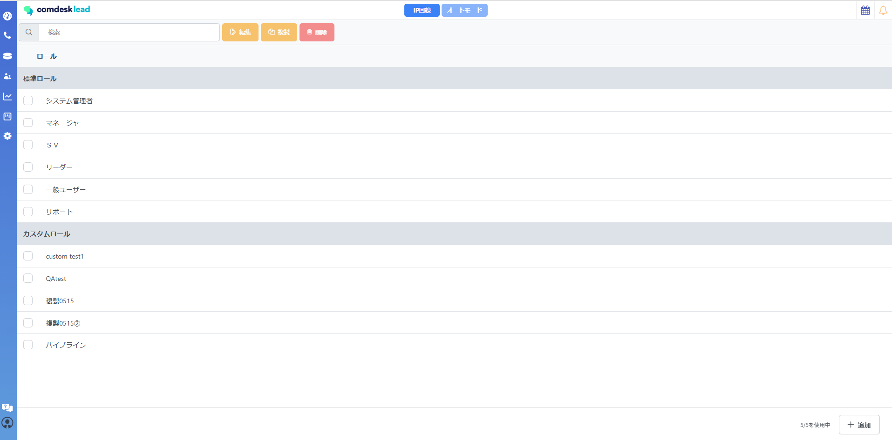
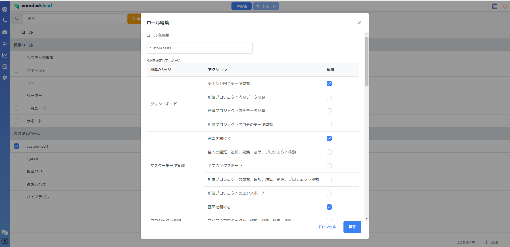

各機能をカスタム可能な、カスタムロールが作成可能になりました。

・標準ロールを複製し、各機能についての権限を付与できます。

　→標準ロール選択後、複製クリックで作成。

・カスタムロールとして、新たに追加ロールも可能でございます。

　→カスタムユーザー種別画面右下から「追加」で新規追加可能です。

・最大5ロールまで追加可能です。

設定方法

Manage>カスタムユーザー種別が新機能として追加されております。

画面右下「+追加」でカスタムロールの新規追加が可能でございます。

各機能に対しての権限を変更の際には、チェックを入れていただき保存をクリック。

作成したロールの種別変更

Manage>ユーザー管理で設定可能でございます。

種別を割り当てたい、ユーザーの編集を行っていただければ割り当て可能でございます。

ユーザー編集クリックで

「ユーザー種別」から作成したロールを選択。

保存クリック後、再ログインで反映可能。
