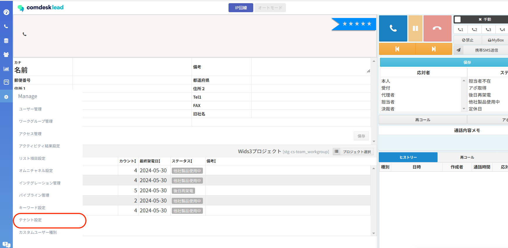
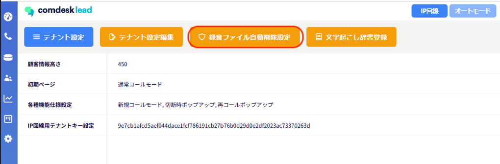
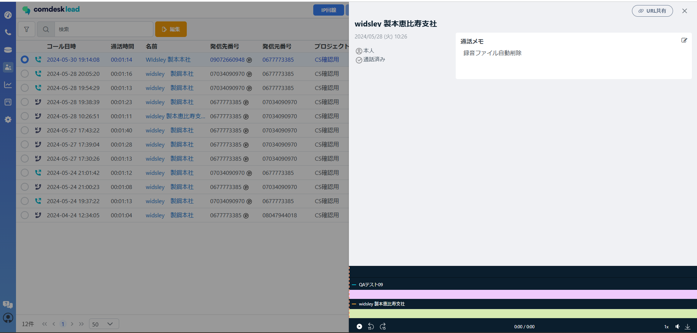

「From」「To」「And」の条件で電話番号を指定し

設定した条件に当てはまった状態で通話が発生した際、録音ファイルをアップロードせず自動的に削除する機能となります。

活用シーン：社内での通話を活動履歴に表示させたくない（他ユーザーに聞かれたくない）場合等に使用できる機能となります。

### ※ご注意事項※

**条件に当てはまり削除された録音ファイルは復元できませんのでご注意ください。**

**弊社でも復元不可となります。**

## **設定方法**

1. 画面左側のManageアイコンを選択し、テナント設定をクリックします。
2. 録音ファイル自動削除設定を選択します。\
   
3.  指定したい番号をFrom条件/To条件/And条件いずれかにご入力ください。入力後、「Enter」を押して保存をクリックします。\
    複数登録の場合はカンマ「,」区切り、「Enter」で確定となります。

    **※\*\*\*\*「Enter」で番号確定（灰色で番号が囲まれている）となります。**\
    **確定されていない状態で保存を押した場合、反映されないためご注意ください。**

・From条件/To条件/And条件について

活動履歴に記載されている発信先/発信元番号を元に削除対象を判断し、録音ファイルを削除します。

&#x20;

From

To

And

発信先番号

✖

〇

〇

発信元番号

〇

✖

〇

〇：削除対象　✖：削除非対象

## **録音ファイル自動削除された場合の活動履歴の表示**

条件を設定し、自動で録音削除された場合、活動履歴での表示が下記画像のような形となります。

活動履歴上に通話時間は記載されていますが、活動履歴詳細を開いた際

録音ファイルが00:00になっており、再生はできない状態になっております。

その他ご不明点などございましたら、[**サポートチームまでお問い合わせ**](https://comdesklead.zendesk.com/hc/ja/requests/new)をお願い致します。

お問い合わせ方法は\*\*[こちら](../../トラブルシューティング/サポートチームへのお問い合わせ方法/12828937533081_サポートチームへのお問い合わせ方法.md)\*\*
