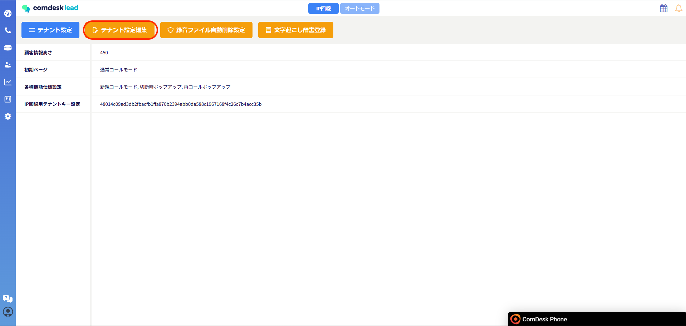
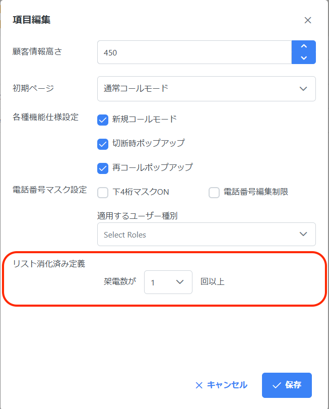

# リスト消化率の設定方法

リスト消化率（架電数が〇回以上）の設定方法についてご説明します。

リスト消化率に関しては[こちら](33250710172825_リスト消化率.md)の記事をご参照ください。

※設定変更後は自動で再計算されないため、以下の注意事項をご確認ください。

1. Manegeからテナント設定を開きます。
2. 赤枠内、「テナント設定編集」をクリックします。
3.  項目編集内の赤枠「リスト消化率定義」の架電数が◯回以上の部分を\
    「1～99回」の中から選択し、保存をクリックします。

    ※ログアウト後、再ログインすることで設定完了です。

    

**【リスト消化済み定義を変更した場合】**

**リスト消化済み定義の架電数を変更後ご連絡いただき、弊社側でリスト消化率の再計算が必要になります。**

**大変お手数ではございますが、変更された場合についてはご連絡お願いいたします。**

その他ご不明点などございましたら、[**サポートチームまでお問い合わせ**](https://comdesklead.zendesk.com/hc/ja/requests/new)をお願い致します。

お問い合わせ方法は\*\*[こちら](../../トラブルシューティング/サポートチームへのお問い合わせ方法/12828937533081_サポートチームへのお問い合わせ方法.md)\*\*
