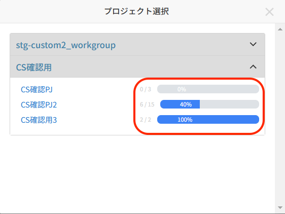
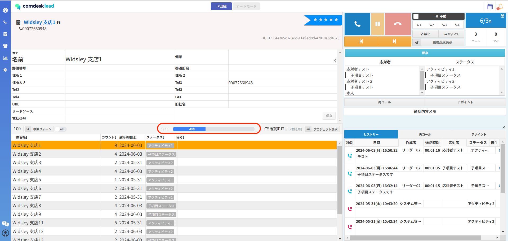
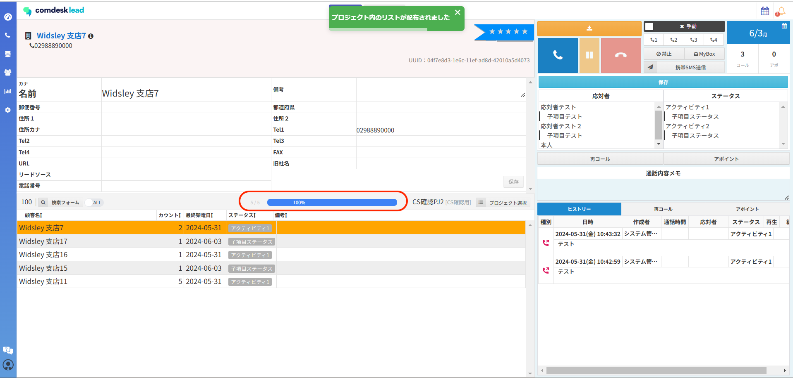
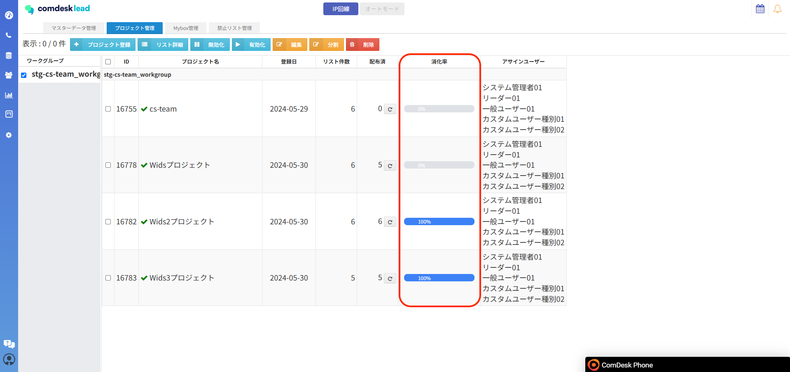

# リスト消化率

#### 6/19夜間のアップデートにつき、新機能のリスト消化率機能が実装されます。

#### プロジェクトに入っているリスト件数のうちどのぐらいが架電済みになっているか、％で表示が可能となります。

消化率から自身がどのぐらい架電しているかや、新たにリストを投入するタイミングを確認することが可能です。

## **リスト消化率とは**

* テナント設定から、「架電数が〇回以上」と設定し、◯回以上架電したリストを消化済みとしてカウントできるようになります。
* 消化済みリストとしてカウントされたリストをプロジェクト内の消化率として、確認できるようになります。

※設定したリスト消化済み定義○○回はテナント全体が対象となります。

**ワークグループごとに設定することはできません。**

初期設定「架電数が1回以上」となっているため、テナント設定から変更が可能です。設定方法は[こちら](33185867607833_リスト消化率の設定方法.md)。

## **リスト消化率定義について**

通常コールと自動配布コールで消化率の定義が異なります。

* **通常コールモード**：「プロジェクト内の総リスト件数」＝母数、「消化済み（架電数が〇回以上）リスト件数」＝分子となり消化率が表示されます。

　**※架電後禁止リストにした場合も消化率に含まれます。**

　表示画面：通常コールモード・コールモードにおけるプロジェクト選択画面・プロジェクト管理画面

* **自動配布コールモード**：「自身に配布された総リスト件数」＝母数、「消化済み（架電数が〇回以上）リスト件数」＝分子となり消化率が表示されます。

　表示画面：自動配布コールモード画面のみ表示

## **リスト消化率の確認画面**

* 通常・自動配布コールモードにおけるプロジェクト選択画面\
  各プロジェクトごとの、分子/分母　消化率の表示がされます。
* **通常コールモード画面**\
  選択したプロジェクトに所属しているリストの中で分子（消化済みリスト件数）/分母（プロジェクト内の総リスト件数）で消化率が表示されます。
* **自動配布コールモード画面**\
  選択したプロジェクトの中で、分子（消化済みリスト件数）/分母（配布された総リスト件数）で消化率が表示されます。　
* \*\*プロジェクト管理画面\
  \*\*リスト件数は表示されず、消化率のみの表示となります。

その他ご不明点などございましたら、[**サポートチームまでお問い合わせ**](https://comdesklead.zendesk.com/hc/ja/requests/new)をお願い致します。

お問い合わせ方法は\*\*[こちら](../../トラブルシューティング/サポートチームへのお問い合わせ方法/12828937533081_サポートチームへのお問い合わせ方法.md)\*\*
