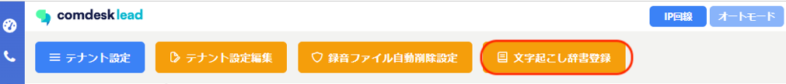
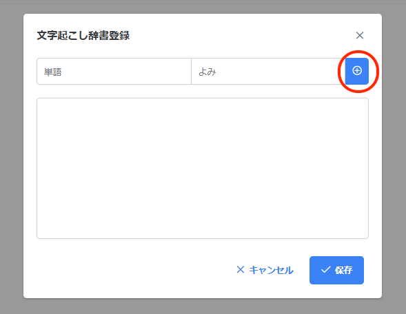
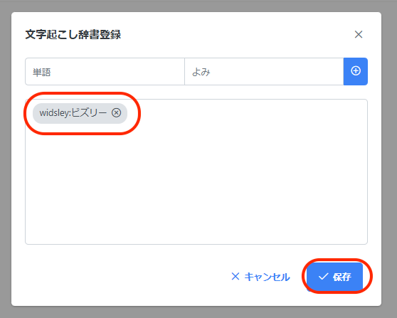

# ▽活動履歴新機能　文字起こし辞書登録について

活動履歴で表示される通話テキストが、「文字起こし辞書登録」が可能になります。

活用シーン：文字起こしがうまくいかない単語を辞書登録すると、文字起こし上で登録した単語に変換されます。

例：「Widsley」がよく「ビズリー」と文字起こしされてしまうので

文字起こし辞書登録を活用し「Widsley」と表示させたい。

## **登録方法**

1. 画面左側のManageアイコンを選択し、テナント設定をクリックします。
2. 赤枠内「文字起こし辞書登録」をクリックします。
3. 文字起こし辞書登録ポップアップが表示されます。\
   　「よみ」に文字起こしされている単語、「単語」に文字起こししたい単語を入力します。\
   入力後、「+ボタン」をクリックします。\
   
4. クリックすると、単語が下の枠に反映されます。\
   反映された状態で保存をクリックで登録完了になります。\
   

**・1000語まで登録可能になります。**

**・30文字以内で作成が可能です（30文字超えている場合は自動で30文字以降が削除されます）**

**※登録された後の文字起こしのみ反映がされます。**

**登録される前の文字起こしに関しては適用外になります。**

その他ご不明点などございましたら、[**サポートチームまでお問い合わせ**](https://comdesklead.zendesk.com/hc/ja/requests/new)をお願い致します。

お問い合わせ方法は\*\*[こちら](../../トラブルシューティング/サポートチームへのお問い合わせ方法/12828937533081_サポートチームへのお問い合わせ方法.md)\*\*
