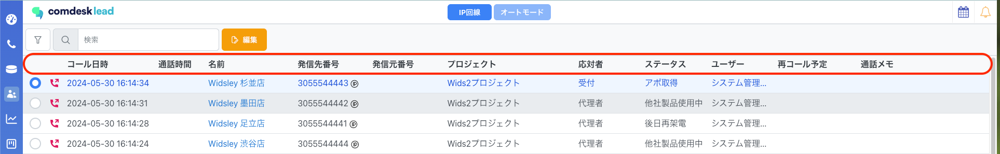
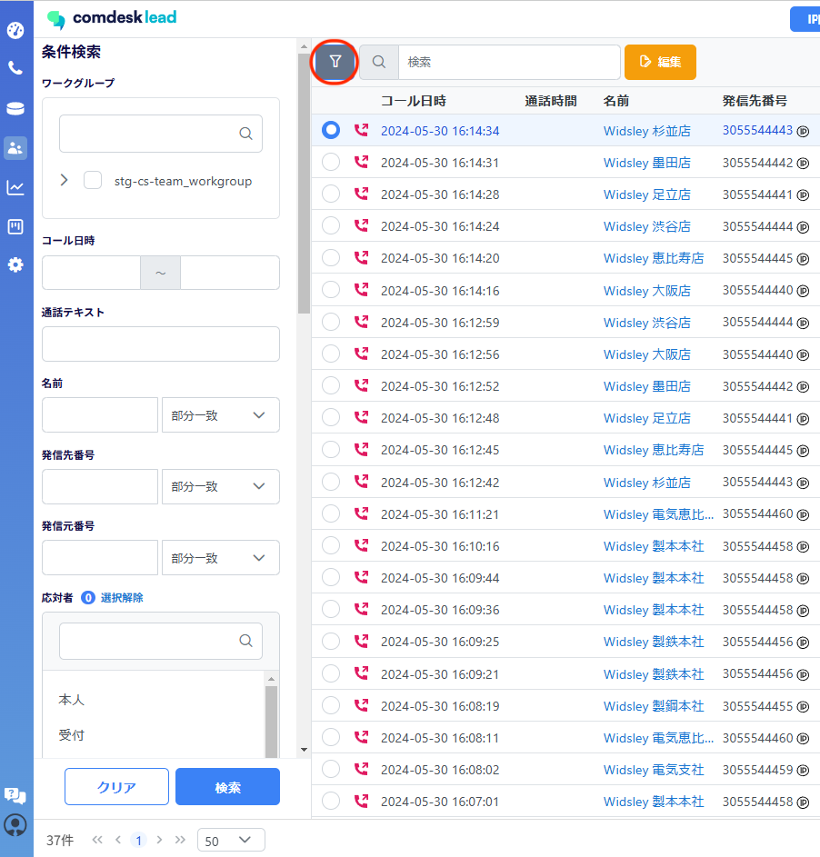
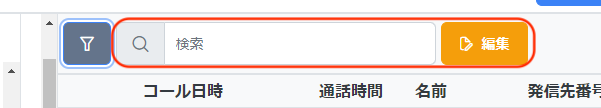
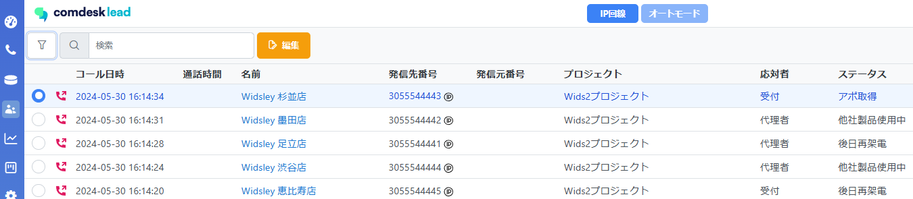
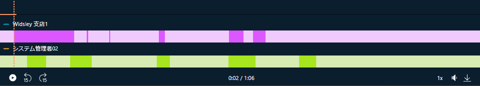

2024/6/5の夜間アップデートにて、活動履歴にアップデートが入ります。

こらちの記事では、活動履歴内で表示できる内容と検索方法についてご説明いたします。

目次

[・活動履歴の表示項目の順番変更](33340552647705_活動履歴の表示と検索方法（アップデート後）.md#h_01HZ6TXT5FB9B0DRCFN2P0VHQX)\
[・検索項目の追加・検索方法の変更](33340552647705_活動履歴の表示と検索方法（アップデート後）.md#h_01HZ78V407TDYBGXQPHBFVGGDG)\
[・応対者・ステータス・通話メモの編集方法](33340552647705_活動履歴の表示と検索方法（アップデート後）.md#h_01HZ790BSTDSQV3T62BZSHX4Z6)\
・[録音再生バーの変更](33340552647705_活動履歴の表示と検索方法（アップデート後）.md#01HZKN4JBGE5FBBVYBFM368SMF)

## **活動履歴の表示項目の順番変更**

表示項目の並び順が変更となります。

左から順に、

* コール日時
* 通話時間
* 名前
* 発信先番号
* 発信元番号
* プロジェクト
* 応対者
* ステータス
* ユーザー
* 再コール予定
* 通話メモ　が表示されます。

## **検索項目の追加・検索方法の変更**

赤枠のフィルターアイコンをクリックすると、画面左側に条件検索ポップアップが表示されます。

**従来の活動履歴の条件検索項目に加え、以下項目が追加で検索可能となります。**

* 通話テキスト：文字起こしされた文章の中から部分一致で検索が可能
* 通話時間：通話が発生した録音の中で◯分以下・◯分以上で検索が可能

**従来からある下記条件検索項目の中で「部分一致・前方一致・後方一致・完全一致・含まない」から選択し、細かく検索が可能となります。**

* 名前
* 発信先番号
* 発信元番号
* 通話メモ

フィルターアイコンで条件検索して表示されている検索結果の中から、更に名前での検索が可能です。

## **応対者・ステータス・通話メモの編集方法**

編集したい活動履歴の赤枠部分を選択し、画面中央部にある「編集」ボタンをクリック後

ダイアログ内で「応対者・ステータス・通話メモ」の編集が可能です。

## **録音再生バーの変更**

発信元（ピンク色）/発信先（緑色）のバーにて別々に表示されます。

音声発生時は、濃い色で表示されます。

その他ご不明点などございましたら、[**サポートチームまでお問い合わせ**](https://comdesklead.zendesk.com/hc/ja/requests/new)をお願い致します。

お問い合わせ方法は\*\*[こちら](../../トラブルシューティング/サポートチームへのお問い合わせ方法/12828937533081_サポートチームへのお問い合わせ方法.md)\*\*
