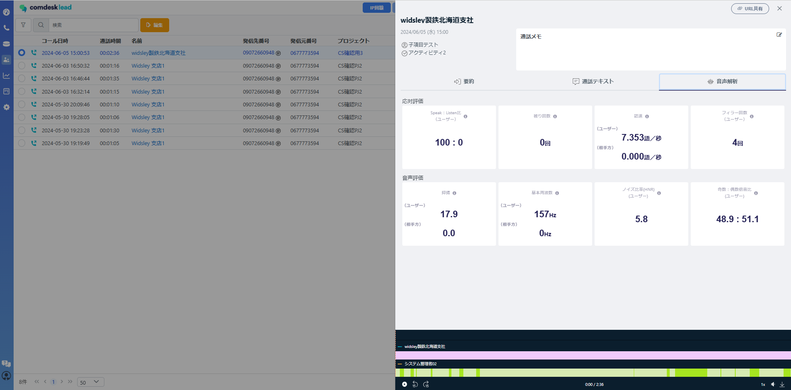
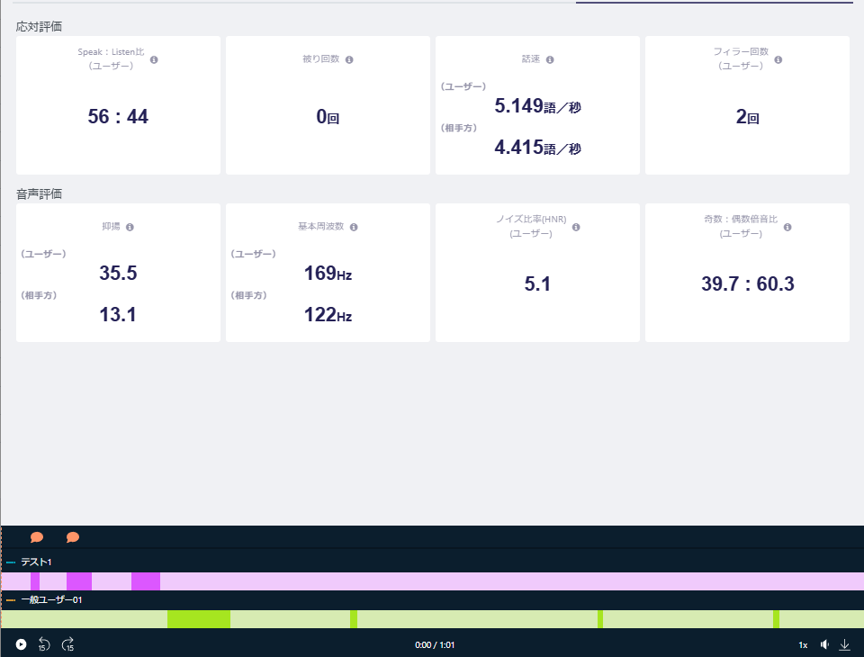

活動履歴の詳細において

通話音声を解析し、数値化できる機能が追加されました。

1分以上の該当活動履歴を開き、「音声解析」タブをクリックすると音声解析が確認できます。

項目としては、以下になります。

**【応対評価】**

・Speak：Listen比（ユーザー）・被り回数・話速・フィラー回数（ユーザー）

**【音声評価】**

・抑揚・基本周波数・ノイズ比率（HNR）（ユーザー）・奇数：偶数倍音比（ユーザー）

それぞれ項目ごとに「？アイコン」がございますので、

内容詳細確認したい場合は「？アイコン」の上にカーソルをのせると詳細確認可能でございます。

**※注意事項※**

・基本周波数が「NaN」になっている場合は、会話が成立せずに周波数が確認できない状態になります。

・フィラー回数が通話テキストと音声解析で異なる場合

　→音声解析におけるフィラーの数値は、単語によってカウントされているので差分が生じることがございます。

その他ご不明点などございましたら、[**サポートチームまでお問い合わせ**](https://comdesklead.zendesk.com/hc/ja/requests/new)をお願い致します。

お問い合わせ方法は\*\*[こちら](../../トラブルシューティング/サポートチームへのお問い合わせ方法/12828937533081_サポートチームへのお問い合わせ方法.md)\*\*
