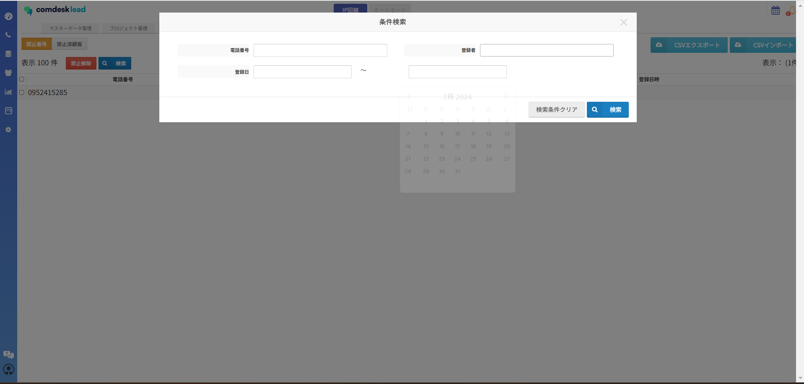
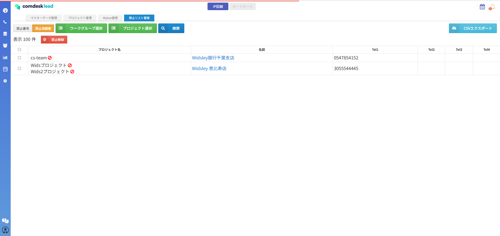

7/10の夜間アップデートにおいて、禁止リスト画面において機能アップデートが予定となっております。

変更点としては、2点になります。

・禁止番号の検索について

・禁止済顧客のエクスポート

**禁止番号の検索について**

禁止番号において検索機能が実装されました。

禁止リスト管理画面から禁止番号を開いた状態で、禁止解除ボタンの横に「検索」が追加されました。

検索可能項目については以下になります。

検索項目：電話番号、登録者、登録日時

禁止番号検索画面

**禁止済顧客のエクスポート**

禁止済顧客を開いた状態で「CSVエクスポート」をクリックしていただけば、CSVデータとしてエクスポートが可能でございます。

エクスポート対象

・禁止済顧客：プロジェクト名、名前、Tel1\~4

禁止済顧客画面（ここを押せばエクスポート可能）

