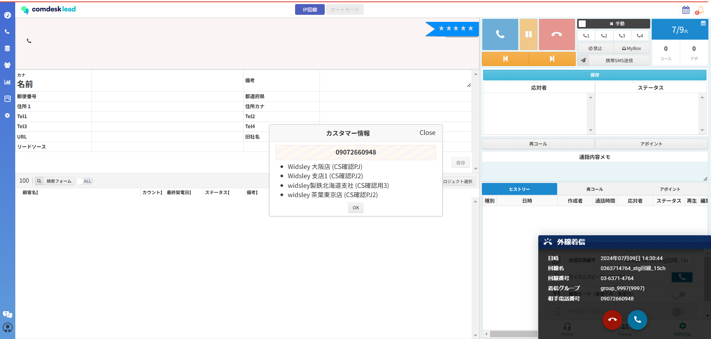
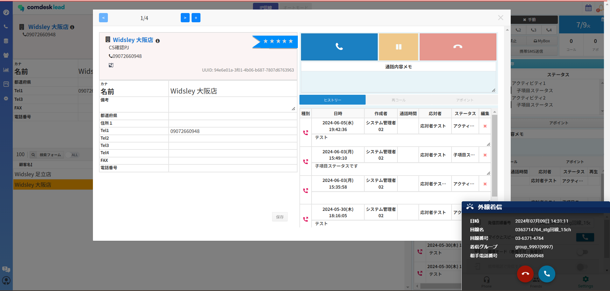
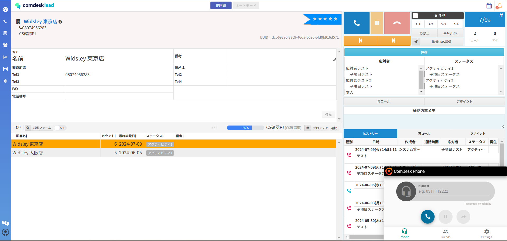

# IP回線での受電方法（アップデート後）

7/10夜間のアップデートにつき、IP回線使用時に受電する際のポップアップの挙動が変更になりました。

他ユーザーが受電した場合若しくはコールが切れた場合でも、画面更新をしないとポップアップは消えず残っている状態でございました。

アップデートによって「コールが切れた」、「他ユーザーが受電した」場合に表示されたポップが自動で消える状態になりました。

**受電時のポップアップ表示について**

・受電があった場合

①「カスタマー情報ダイアログ」②「受電ダイアログ」の順で表示されます。

・コールが切れるもしくは他ユーザーが受電したと同時に、どちらのダイアログも閉じるようになります。

・受電の確認において、活動履歴から受電があったかを確認可能です。

　受電の方法に関しては、[こちら](../../機能一覧/基本ガイド/31336370476825_IP回線利用時の受電方法（アップデート後）.md)

（（受電があった際には画面右下Comdesk Phoneが立ち上がるのでコール画面上でも確認可能です。））

①カスタマー情報ダイアログ

②受電ダイアログ

受電があり、コール切れた場合のコール画面（Comdesk Phoneが立ち上がった状態）

