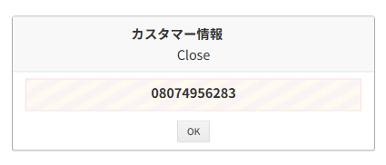
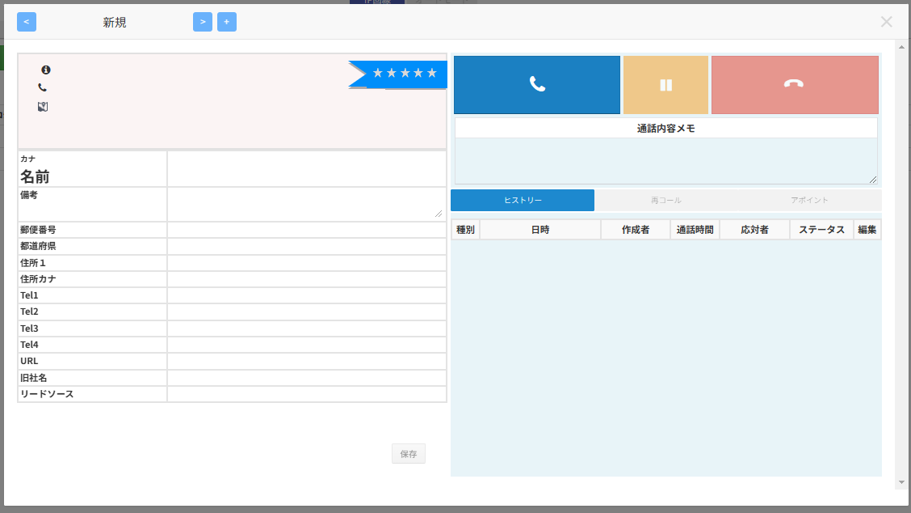

平素より大変お世話になっております。Widsley Customer Supportでございます。

いつもComdesk Leadのご利用いただき、誠にありがとうございます。

2024年07月10日夜間にて、Comdesk Leadの一部機能を改修リリースを実施いたします。

挙動や仕様において、一部変更となる部分がございますので、ご認識いただけますと幸いです。

### ▽着信時に表示されるポップアップ/ダイアログの表示変更

着信があった際に表示される①カスタマー情報ダイアログ②受電ダイアログは

他のユーザーが通話を開始もしくは通話を開始する前に切れた場合、表示している①or②は自動で閉じる仕様に変更となります。

①カスタマ情報ダイアログ

②受電ダイアログ

▽禁止番号の検索が可能に！

禁止リスト管理から、禁止番号の検索が可能になります。

＜検索項目＞

* 電話番号
* 登録者
* 登録日

▽禁止済顧客のCSVエクスポートが可能に！

禁止リスト管理における禁止済顧客がCSVエクスポートが可能になります。

＜エクスポート項目＞

* プロジェクト名
* 名前
* Tel1～4

——————————————————————————–————————————————–——

リリース日時 ： 2024年07月10日(水) 22：00～26：00頃

※サービスの停止はありません。

——————————————————————————–————————————————–——

その他ご不明点・ご意見などございましたら、サポートチームまでお問い合わせをお願いいたします。

　→お問い合わせ方法はこちら （初めてのお問い合わせ方法はこちら）

——————————————————————————–————————————————–——

今後も、より一層みなさまのお役に立てるよう取り組んでまいりますので

引き続き、Comdesk Leadのご愛顧を賜りますよう心よりお願い申し上げます。
