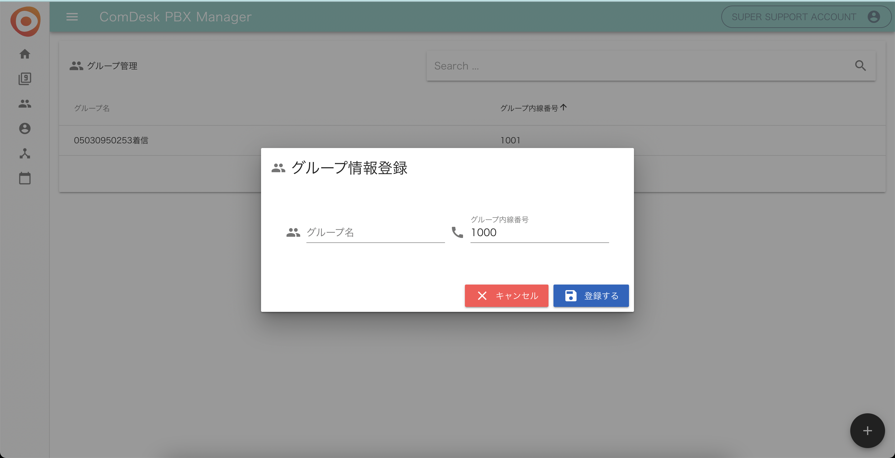
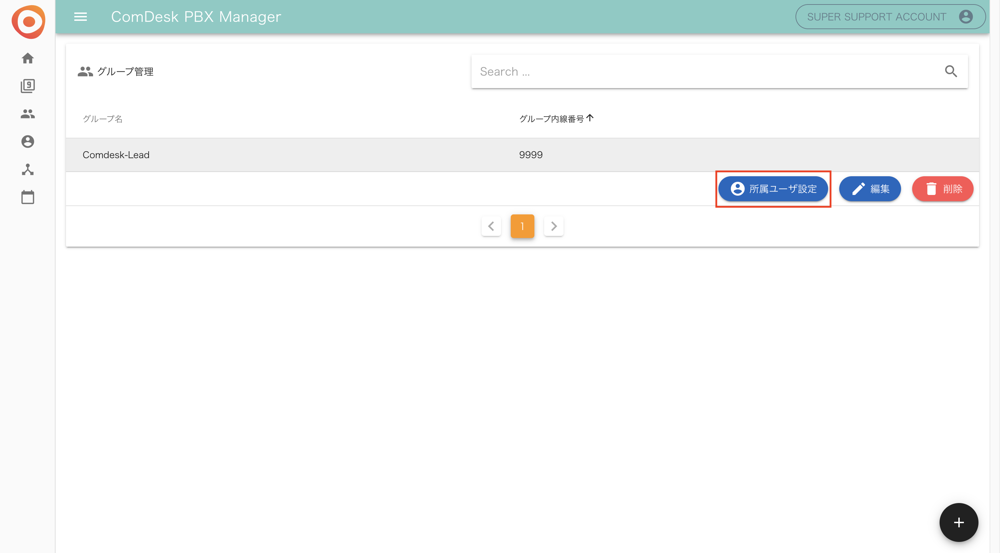
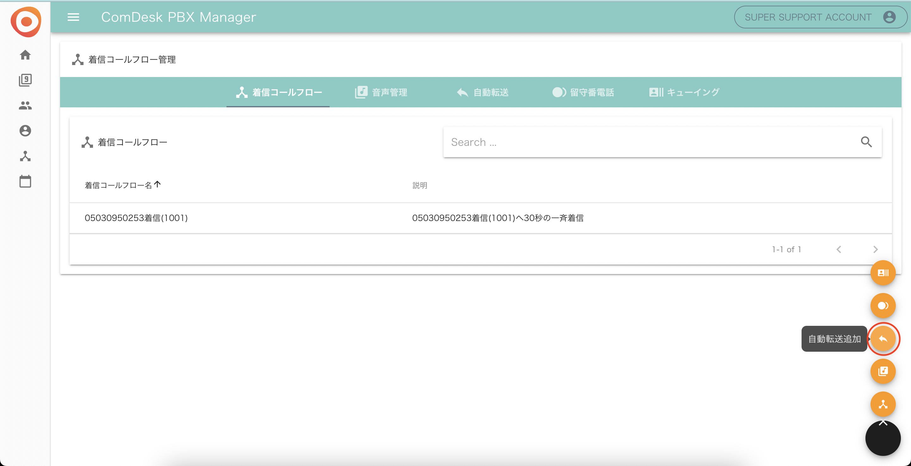
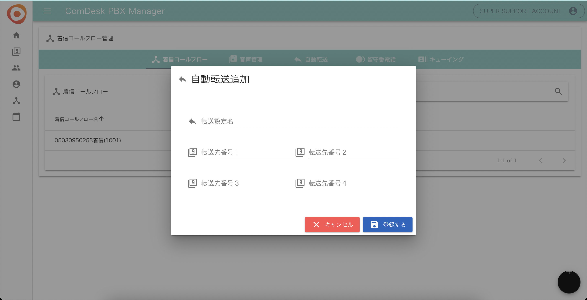
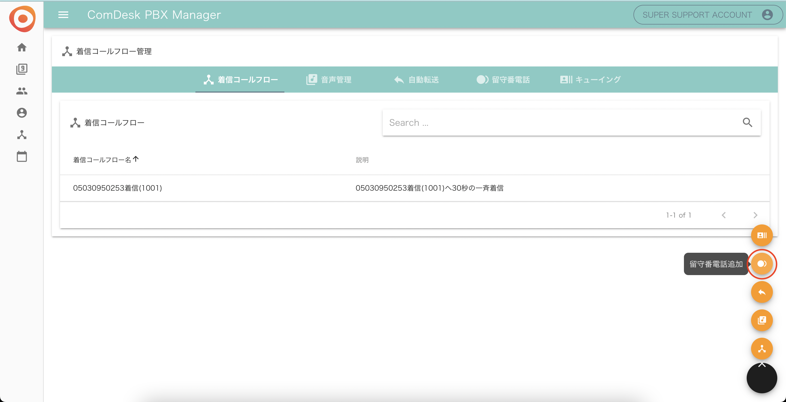
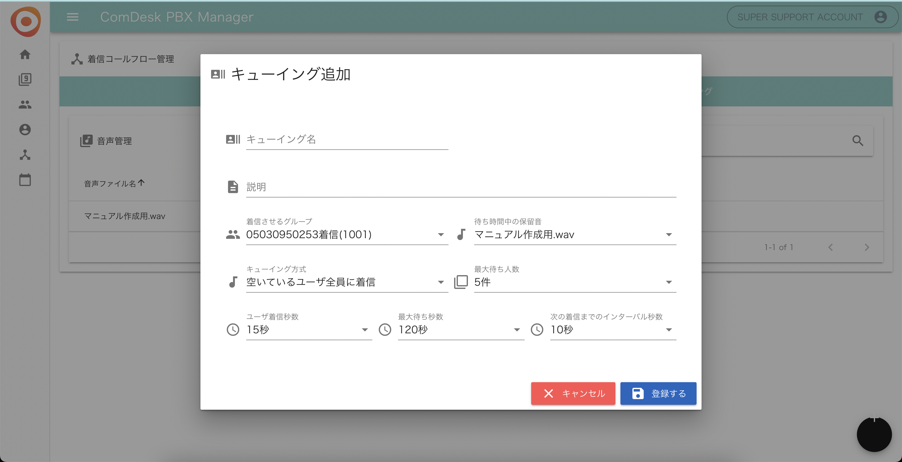

# PBX：Step1

## **Step1．着信パーツの作成**

#### **step1～step3の手順を踏むことで以下のような設定を適用できます。**

#### **例）時間外アナウンス：営業時間外には自動音声が流れるように設定**

#### **転送設定：携帯宛に転送設定が可能（最大4番号になります**

#### **受電：番号に対して、受電があった際に設定が必要になります**

#### **着信パーツで設定できること、以下のようなことができます。**

**・着信グループ（着信を受けれるユーザー/着信を受けないユーザーの選択が可能）**

\*\*・\*\***音声管理（営業時間外等の音声をアップロード可能）**

\*\*・\*\***自動転送（転送する番号の登録※転送先がフリーダイヤルの場合は設定負荷になります）**

**・留守番電話（相手のメッセージを録音）**

**・キューイング（応答可能なオペレーターがいない場合にガイダンスを流し、お客様にお待ちいただく）**

### **着信グループ**

回線ごとに、着信を受けるユーザーをグループに設定します。

1. PBX Managerの「グループ管理」を開きます。\
   ※PBX Managerとは、IP回線の設置をする画面です。URLは管理者の方に弊社よりご案内致します。\
   
2. グループ管理画面右下の「＋」ボタンをクリックします。\
   
3.  「グループ情報登録」のモーダルが表示されるので、\
    &#xNAN;**・グループ名**：必須項目\
    &#xNAN;**・グループ内線番号**：指定がない場合はデフォルト値の9999とし「登録する」をクリックします。

    
4. 上記3で設定したグループ名をクリックし「所属ユーザ設定」をクリックします。
5. 着信グループに入れたいユーザを選択して下さい。最上部のチェックボックスにチェックを入れると全選択となります。選択が完了しましたら、「登録する」をクリックします。

### **音声管理**

営業時間外アナウンスや休日アナウンスの音声をアップロードします。\
（音声が必要な場合は、サポート宛にメールで文言をいただければ作成いたします。）

1.  「着信コールフロー管理」画面を開きます。

    
2.  右下の黒い円にマウスカーソルを合わせて表示されるオレンジ色のメニューから、音声追加アイコン（赤枠）をクリックします。

    
3. 音声追加画面で音声ファイル（wavファイルのみ対応可能）をドラッグアンドドロップすると、自動的にアップロードが終了します。

### **自動転送**

転送先の電話番号を設定します。

1. 「着信コールフロー管理」を開きます。\
   
2.  右下の黒い円にマウスカーソルを合わせて表示されるオレンジ色のメニューから、自動転送追加アイコン（赤枠）をクリックします。

    
3.  自動転送追加画面が表示されます。

    **・転送設定名**：必須入力項目

    **・転送先番号１〜４**：いずれか１つ入力し「登録する」をクリックします。

    ※転送時には、4つの番号に対して同時に転送をし、1人の方が出ると他の方の鳴動は止まります。

    

### **留守番電話**

留守番電話の設定をします。

1. 「着信コールフロー管理」を開きます。\
   
2.  右下の黒い円にマウスカーソルを合わせて表示されるオレンジ色のメニューから、留守番電話追加アイコン（赤枠）をクリックします。

    
3. 留守番電話追加画面が表示されます。\
   &#xNAN;**・留守番電話設定名**：必須入力項目\
   &#xNAN;**・録音秒数**：10秒以上120秒以内で入力し「登録する」をクリックします。\
   

### **キューイング**

オペレータの人数以上に着信が来てしまった場合でもキューイング機能をお使いいただくことで、オペレーターが空くまでお待ちいただくことが可能です。

1.  「着信コールフロー管理」を開きます。

    
2.  右下の黒い円にマウスカーソルを合わせて表示されるオレンジ色のメニューから、キューイング追加アイコン（赤枠）をクリックします。

    
3.  キューイング追加画面が表示されますので各必要項目を埋め、「登録する」をクリックします。

    **・キューイング名**：必須入力項目\
    &#xNAN;**・着信させるグループ**：登録している着信グループから１つ選択\
    &#xNAN;**・待ち時間中の保留音**：アップロードしている音声ファイルから１つ選択\
    &#xNAN;**・キューイング方式**：選択項目\
    &#xNAN;**・最大待ち人数**：選択項目\
    &#xNAN;**・ユーザ着信秒数**：選択項目\
    &#xNAN;**・最大待ち秒数**：選択項目\
    &#xNAN;**・次の着信までのインターバル秒数**：選択項目\
    
