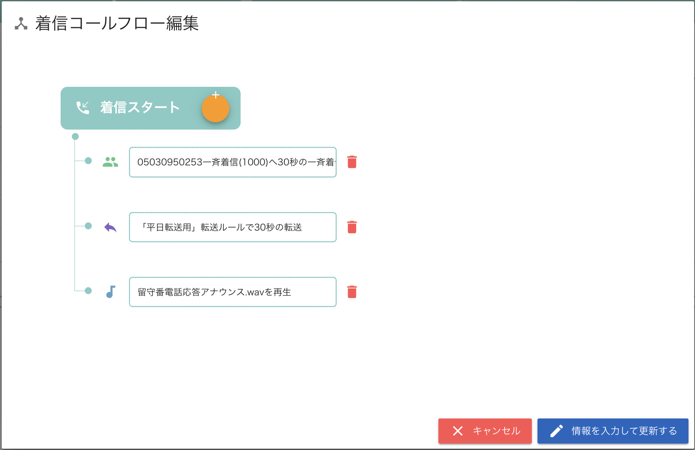
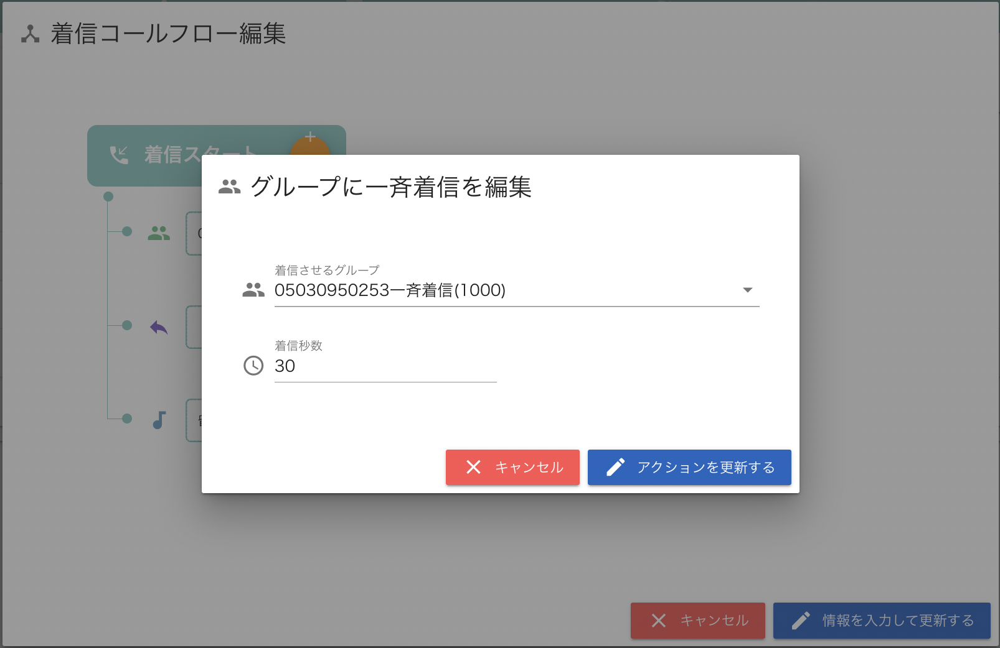
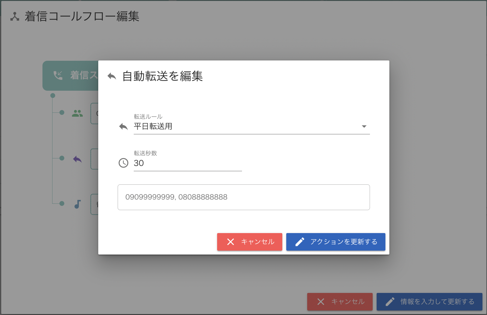
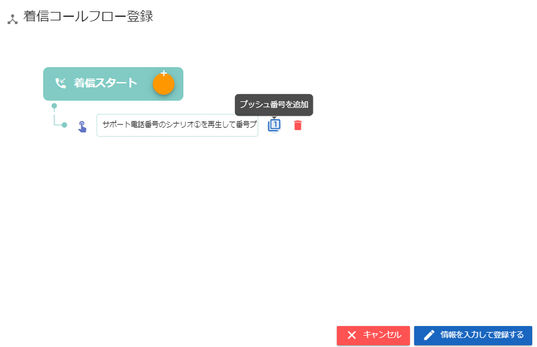

# PBX：Step2

## \*\*Step2．\*\***着信コールフローの作成・IVR設定**

Step1で作成した着信パーツを使用して、着信コールフローを作成します。

ここでは、着信が来た際にどのような流れで着信を受けるかというフローを作成します。

### **着信コールフローの作成**

1. 「着信コールフロー管理」を開きます。
2. 右下の黒い円にマウスカーソルを合わせて表示されるオレンジ色のメニューから、着信コールフロー追加アイコン（赤枠）をクリックします。
3.  着信コールフロー登録画面が表示されますので、着信コールフローを作成します。\
    \
    各アイコンの説明は以下のとおりです。\
    

    例1）

    ①グループに30秒間一斉着信

    ↓

    ②一斉着信で誰も出なかった場合、携帯電話へ30秒間転送

    ↓

    ③転送先の携帯電話で誰も出なかった場合、留守番電話アナウンスを流す

    

    上記の例1）を設定するには、以下のように操作します。\
    ①グループに30秒間一斉着信の設定\
    

    ②携帯電話へ30秒間転送の設定\
    

    ③留守番電話アナウンスの設定\
    
4. 「情報を入力して更新する」をクリックし完成です。

### **IVR設定**

IVR設定とは、○○に御用の方は１を、○○へお問い合わせの方は２を・・・のようなアナウンスを流し、押下された番号によって設定ができます。　

１．着信コールフロー作成で、番号押下後の対応を作成します。

２．着信コールフロー追加を押下、着信コールフロー登録ポップアップの画面で「音声を再生し、番号プッシュ入力を受け付ける」を選択します。

３．最初に再生するアナウンスの音声（○○に御用の方は１を、○○へお問い合わせの方は２を・・・）を選択し、アクションを追加するを押下する。
