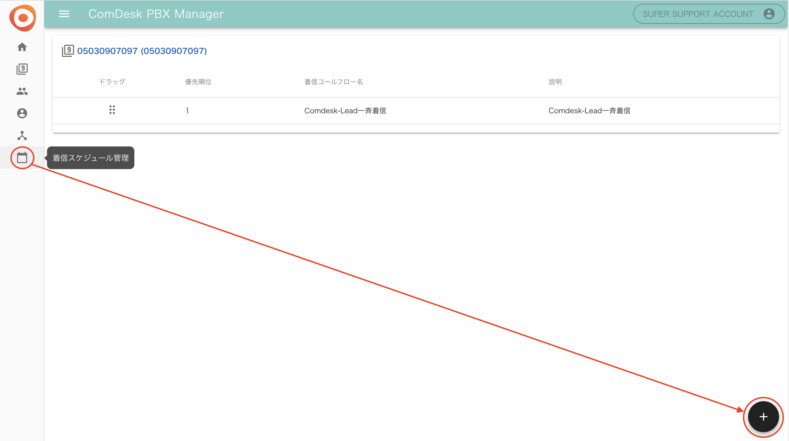
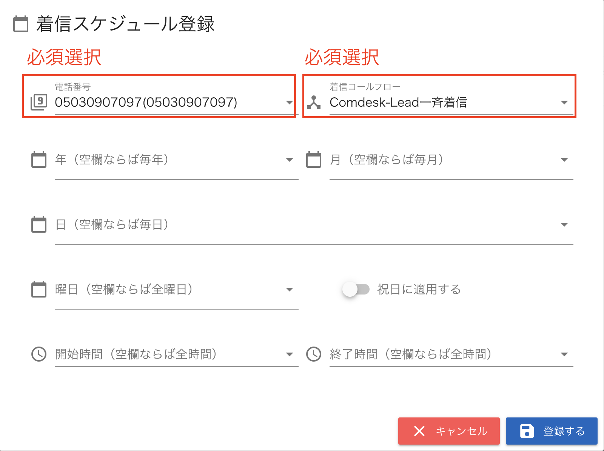
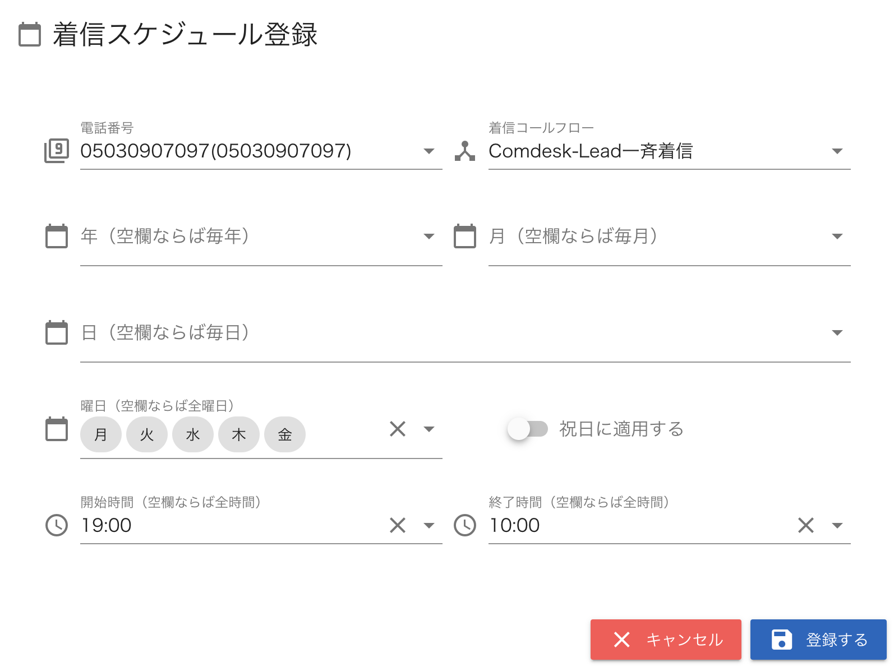
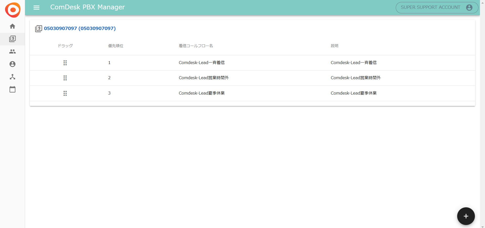
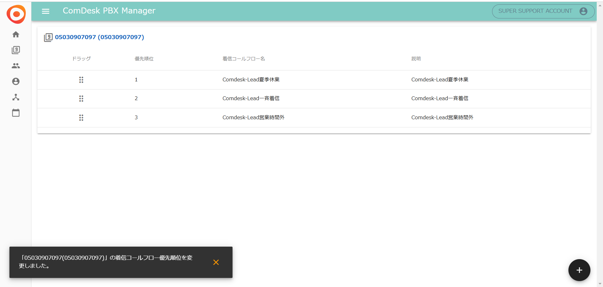

## **Step3．着信スケジュールの作成**

Step2で設定した着信フローをいつ適用するかを設定します。

1.  「着信スケジュール管理」を開き、右下の「＋」をクリックします。\*\*

    \*\*
2. 各項目を入力します。\
   &#xNAN;**・電話番号**：適用させる電話番号を選択\
   &#xNAN;**・着信コールフロー**：適用させる着信コールフローを選択\
   &#xNAN;**・年月日**：適用させる年月日を選択\
   &#xNAN;**・曜日**：適用させる曜日を選択\
   &#xNAN;**・祝日に適用する**：祝日に適用する場合はONにする\
   &#xNAN;**・開始時間**：着信コールフロー を適用開始する時間を選択\
   &#xNAN;**・終了時間**：着信コールフロー を適用終了させる時間を選択&#x20;

* &#x20; 

例1）「平日営業時間内（営業時間は10時〜19時）」の設定するには以下のように入力します。

　　　┗曜日を入れると、毎週その曜日に繰り返し適用されます。

例2）「平日営業時間外（営業時間は10時〜19時）」の設定するには以下のように入力します。

例3）「土日祝日の終日」の設定するには以下のように入力します。

　　　┗開始時間・終了時間を入力しないと終日適用となります。

**着信スケジュールの優先順位**

開始時間・終了時間が重なっている場合に優先順位を決める必要があります。

例）夏季休業において、本来営業時間だが指定した期間のみ適用させたい➡着信スケジュールに日付を登録後、夏季休業のコールフローを優先順位を1に移動させる。

1. 　ドラッグの部分をクリックし、設定したい優先順位に持ってくる。
2. 優先順位を変更すると、画面左下にポップアップが表示される。\
   優先順位が設定したいものになっているか確認。\
   
