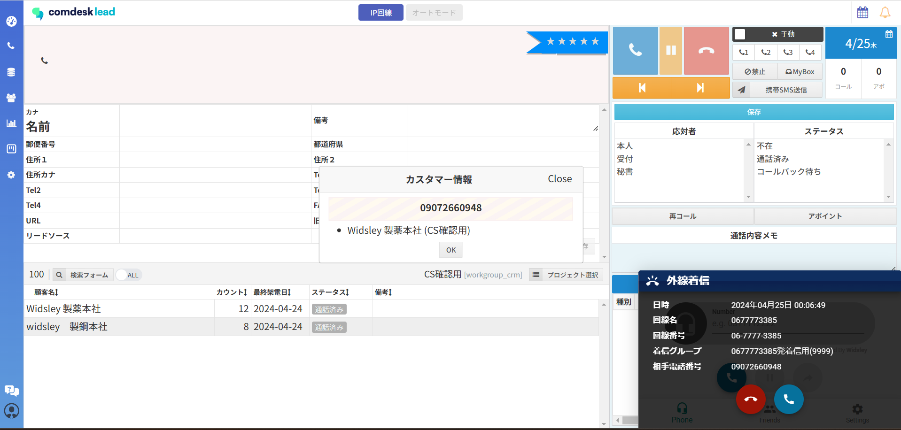
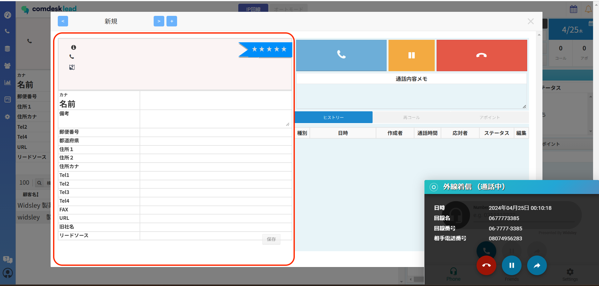

# IP回線利用時の受電方法（合体用）

## **IP回線着信時の受電方法**

1.  IP回線着信時に、Comdesk Lead画面中央にポップアップが表示されます。

    既にリストに登録されている顧客（番号）に関しては、以下のサジェストが表示され、

    リスト名＿プロジェクト名

    登録されていない顧客（番号）からの着信の場合には、以下が表示されます。

    番号のみ
2. 着信時、ポップアップに表示されている赤枠リストの中から、ヒストリーを残したいリストをクリックします。\
   赤枠リストが表示されていない場合には、通話終了後に新規登録していただく形になります。\
   （新規登録した後紐づく形になります。登録前の履歴は紐づかない形になります。）\
   
3. 2で選択した受電専用のダイアログが表示され、いずれかの顧客詳細の受話器（赤枠）アイコンをクリックします。右上の受電ボタン（青）をクリックし、通話を開始します。\
   通顧客詳細内の「＜」「＞」ボタンから、どのリストから着信があったか通話中に確認ができます。\
   ・顧客登録がある場合\
   （顧客登録以外の場合、受電ダイアログ中左上プラスボタン押すことで顧客登録がない状態が開かれます。）\
   \
   ・顧客登録がない場合\
   画面左側の顧客情報の部分は入力不可な仕様のため、「通話内容メモ」に必要な情報を記入します。\
   
4. 通話中に該当のリストが見つかったら、該当のリストを開いた状態で「通話内容記録メモ」を入力します。\
   通話が終了したら、該当の顧客詳細を開いた状態で切電ボタン（青枠）をクリックします。\
   &#xNAN;**※切電ボタンをクリックしたリストにヒストリーが紐付きます。**\
   **異なるリストで切電ボタンをクリックしないようご注意ください。**
5.  通話が終了後、「通話内容記録メモ」を残し、保存し通話終了となります。

    ※複数タブを開いている場合や、手順通りに着信を受けていない場合は、関連のないリストのヒストリーに紐付いてしまう可能性があります。

その他ご不明点などございましたら、[**サポートチームまでお問い合わせ**](https://comdesklead.zendesk.com/hc/ja/requests/new)をお願いいたします。

お問い合わせ方法は\*\*[こちら](../../トラブルシューティング/サポートチームへのお問い合わせ方法/12828937533081_サポートチームへのお問い合わせ方法.md)\*\*
