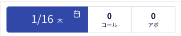

平素より大変お世話になっております。Widsley Supportでございます。

いつもご利用ありがとうございます。

本日（2025/01/16）夜間リリースにて、Comdesk Leadに下記リリースを実施予定でございます。

挙動や仕様において、一部変更となる部分がございますので、ご認識いただけますと幸いです。

——————————————————————————–————————————————–——

【Web】

■コンタクトモード

・コンタクトモードの画面左上部にて、コール数/アポイント数のカウントが表示されるようになりました。

——————————————————————————–————————————————–——

リリース日時 ： 2025年01月16日(木)  21：00～26：00頃

※サービスの停止はありません。

——————————————————————————–————————————————–——

以上、ご確認ください。

ご不明点ございましたら、お気軽にサポート窓口・担当CSまでご連絡くださいませ。

今後も、より一層みなさまのお役に立てるよう取り組んでまいりますので

引き続き、Comdesk Leadのご愛顧を賜りますよう心よりお願い申し上げます。
