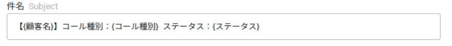
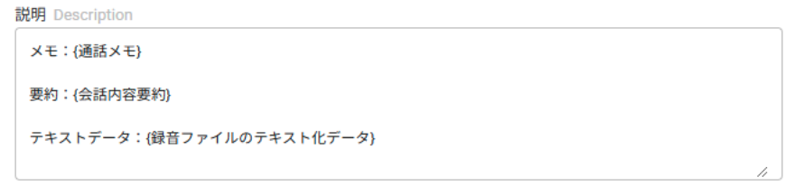
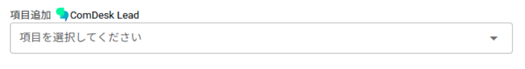

平素より大変お世話になっております。Widsley Supportでございます。

いつもご利用ありがとうございます。

本日（2025/03/13）夜間リリースにて、昨日予定しておりました下記リリースを実施予定でございます。

挙動や仕様において、一部変更となる部分がございますので、ご認識いただけますと幸いです。

——————————————————————————–————————————————–

【Web】

・活動履歴や再コール画面においてワークグループやプロジェクトで絞り込みを行い

ページ遷移すると絞り込みが外れてしまう不具合を修正いたしました。

・マスターデータ画面や通常コールモード画面の「検索テンプレート」において

最終架電日でテンプレートを作成した際、設定した時刻が世界標準時刻になっていたものを日本標準時刻に修正いたしました。

【Salesforce連携】

・Step4 に「件名と説明への連携詳細設定」が追加されました。

┗件名と説明に、自由入力のテキストと既存のComdesk  Leadのデータ項目を設定し連携させることができるようになります。

＜件名と説明の項目設定例＞

件名に顧客名と、コール種別、ステータスを連携させる

説明に通話メモ、会話内容の要約、会話全文のテキストを設定

{}で囲まれている部分はデータで、項目追加から選択することで追加することが可能となります。

——————————————————————————–————————————————–

リリース日時 ： 2025年03月13日(木）  21：00～26：00頃

※サービスの停止はありません。

——————————————————————————–————————————————–

以上、ご確認ください。

ご不明点ございましたら、お気軽にサポート窓口・担当CSまでご連絡くださいませ。

今後も、より一層みなさまのお役に立てるよう取り組んでまいりますので

引き続き、Comdesk Leadのご愛顧を賜りますよう心よりお願い申し上げます。

——————————————————————————–————————————————–
