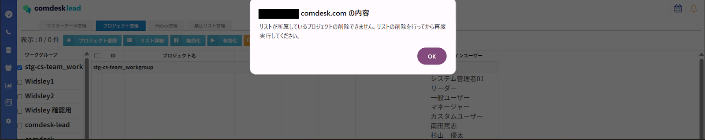

# 2025/04/09　Comdesk Lead夜間リリースのお知らせ

平素より大変お世話になっております。Widsley Supportでございます。

いつもご利用ありがとうございます。

本日（2025/04/09）夜間リリースにて、Comdesk Leadに下記リリースを実施予定でございます。

挙動や仕様において、一部変更となる部分がございますので、ご認識いただけますと幸いです。

——————————————————————————–————————————————–——

【Web】

・リストインポート時に除外指定していないにも関わらず、画面右上のベルマーク内に「除外指定によりスキップされました」と表示されてしまう不具合を修正いたしました。

・Mybox管理画面において、システム管理者とMybox担当者以外は解除若しくは変更できてしまう不具合を修正いたしました。

・Mybox管理画面において、「全件処理」ボタンからMyboxの担当変更を実施した際

選択している件数に対して権限内で何件処理が完了したか完了件数が表示されるようになりました。

・リストが入っているプロジェクトの削除が不可になりました。\
　┗1件でもリストが所属しているプロジェクトを削除しようとした場合\
ポップアップ（下記画像）が表示され、プロジェクトの削除ができない仕様となりました。

プロジェクトを削除する場合は該当プロジェクトに所属しているリストを削除した後、プロジェクトの削除が必要となります。

【Mobile Client】

・配布コールモードでオートコールを使用時に禁止番号に架電できてしまう不具合を修正いたしました。\
　┗禁止番号設定されているリストが配布された場合は、Webと同様にオートコールが一時停止となります。

オートコールが一時停止した場合、同リストの禁止番号に登録されていない番号へ架電を行うか

再度別のリストを配布し、オートコールモードを再開してください。

Android端末にて、Mobile Clientをご利用中のお客様に関しましては

・Playストアで「Comdesk Lead」アプリの更新

・Playストア上でアプリの更新ができない場合はアプリをアンインストールし、再インストール

　をお願いいたします。

最新バージョン：1.2.15

操作方法は以下の記事をご参照ください。

・[アンインストール方法](../../機能一覧/基本ガイド/14501428133145_MobileClient_アンインストール.md)

・[インストール方法](../../機能一覧/基本ガイド/14501355033241_MobileClient_インストール.md)

——————————————————————————–————————————————–——

リリース日時 ： 2025年04月09日(水）  21：00～26：00頃

※サービスの停止はありません。

——————————————————————————–————————————————–——

以上、ご確認ください。

ご不明点ございましたら、お気軽にサポート窓口・担当CSまでご連絡くださいませ。

今後も、より一層みなさまのお役に立てるよう取り組んでまいりますので

引き続き、Comdesk Leadのご愛顧を賜りますよう心よりお願い申し上げます。

——————————————————————————–————————————————–——
