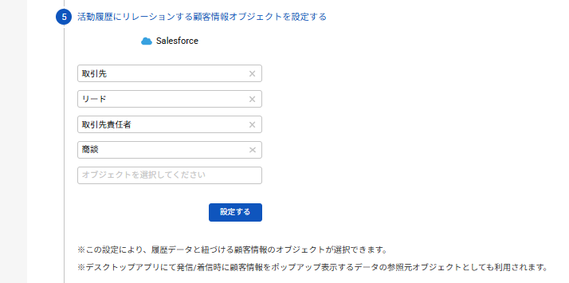

# 2025/05/14　Comdesk Lead夜間リリースのお知らせ

平素より大変お世話になっております。Widsley Supportでございます。

いつもご利用ありがとうございます。

本日（2025/05/14）夜間リリースにて、Comdesk Leadに下記リリースを実施予定でございます。

挙動や仕様において、一部変更となる部分がございますので、ご認識いただけますと幸いです。

——————————————————————————–————————————————–——

【Web】

■機能改修

・マスターデータ管理画面にてページ遷移した際に、スクロールバーが遷移前の場所に固定されてしまう不具合を

ページ遷移してもスクロールバーが一番上にくるように改修いたしました。

・コンタクトモード画面において再コールの設定時に時間を削除した際に、日付までリセットされてしまう不具合を改修いたしました。

・マスターデータ管理画面＞リスト全選択＞全件処理＞削除　を実施した際

消化率の計算が正しく処理されない不具合を改修いたしました。

【CRM連携】

■Salesforce連携　追加機能

・連携設定のStep5において、単一オブジェクトのみ連携から複数オブジェクト連携できるようになりました。（下記画像参照）

┗連携したい項目に優先順位を選択できるようになります。（最大5つまで設定可）\

【デスクトップアプリ】

■追加機能

・着信時、デスクトップアプリ上に表示されている電話番号がコピーできるようになりました。

┗デスクトップアプリ上はハイフンありで表示されておりますが、貼り付け時にはハイフンが抜かれた状態となります。

・通話内容記録をONにしている場合、発着信時共に通話内容記録画面でステータスが初期値で入力された状態になりました。（※ステータスの入力必須）

┗Comdesk Leadに登録がある電話番号は、リストが所属しているワークグループの応対者・ステータスが候補として表示されます。

Comdesk Leadに登録がない番号からの着信の場合は

初期で作成されているワークグループ（テナント名\_workgroup）で有効になっている応対者・ステータスが候補として表示されます。

デスクトップアプリをご利用のお客様に関しましては、再インストールをお願いいたします。\
最新バージョン：1.1.4

操作方法は以下の記事をご参照ください。\
・[Comdesk Phone（デスクトップアプリ） アプリインストール WindowsOS](../../機能一覧/活用ガイド/14502240732825_ComDesk_Phone（デスクトップアプリ）_アプリインストール_WindowsOS.md)\
・[Comdesk Phone（デスクトップアプリ） アプリインストール macOS](../../機能一覧/活用ガイド/14508506030489_Comdesk_Phone（デスクトップアプリ）_アプリインストール_macOS.md)

——————————————————————————–————————————————–——

リリース日時 ： 2025年05月14日(水）  21：00～26：00頃

※サービスの停止はありません。

——————————————————————————–————————————————–——

以上、ご確認ください。

ご不明点ございましたら、お気軽にサポート窓口・担当CSまでご連絡くださいませ。

今後も、より一層みなさまのお役に立てるよう取り組んでまいりますので

引き続き、Comdesk Leadのご愛顧を賜りますよう心よりお願い申し上げます。

——————————————————————————–————————————————–——
