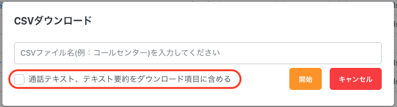

# 2025/06/18　Comdesk Lead夜間リリースのお知らせ

平素より大変お世話になっております。Widsley Supportでございます。

いつもご利用ありがとうございます。

本日（2025/06/18）夜間リリースにて、Comdesk Leadに下記リリースを実施予定でございます。

挙動や仕様において、一部変更となる部分がございますので、ご認識いただけますと幸いです。

——————————————————————————–————————————————–—————————————

### 【Web】

**■活動履歴のダウンロード時に「テキスト要約・通話テキスト」を選択し、ダウンロードが可能になります。**

CSVダウンロード時に表示されるポップアップ内に「通話テキスト、テキスト要約をダウンロード項目に含める」のチェックボックスが追加され、CSVダウンロード項目に含めるかの選択が可能になります。

※デフォルトはOFFとなっております。

\
&#x20;

**■禁止済顧客の検索後にページ遷移した際の不具合を修正いたしました。**

禁止リスト管理＞禁止済顧客　内で条件検索後に「次ヘ」・「戻る」でページ遷移すると、検索した条件が外れてしまう不具合を修正いたしました。&#x20;

——————————————————————————–————————————————–—————————————

リリース日時 ： 2025年06月18日(水）  21：00～26：00頃

※サービスの停止はありません。

——————————————————————————–————————————————–—————————————

以上、ご確認ください。

ご不明点ございましたら、お気軽にサポート窓口・担当CSまでご連絡くださいませ。

今後も、より一層みなさまのお役に立てるよう取り組んでまいりますので

引き続き、Comdesk Leadのご愛顧を賜りますよう心よりお願い申し上げます。

——————————————————————————–————————————————
