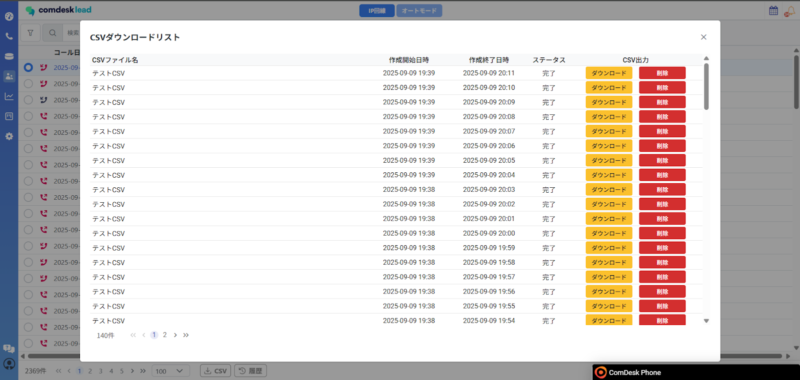
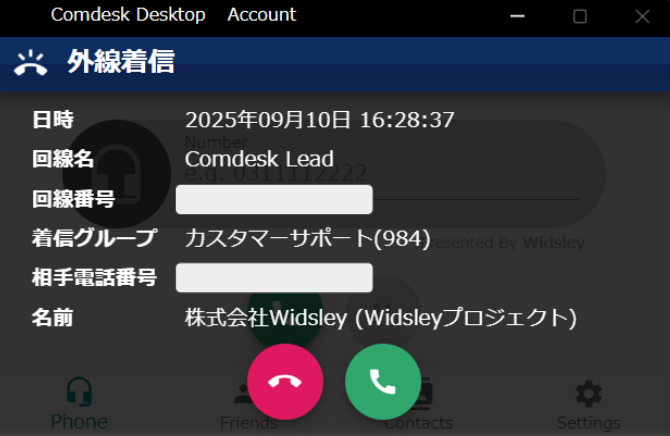

# 2025/09/10　Comdesk Lead夜間リリースのお知らせ

平素より大変お世話になっております。Widsley Supportでございます。

いつもご利用ありがとうございます。

本日（2025/09/10）夜間リリースにて、Comdesk Leadに下記リリースを実施予定でございます。

挙動や仕様において、一部変更となる部分がございますので、ご認識いただけますと幸いです。

——————————————————————————–————————————————–——————–——

### **【Comdesk Lead Web】仕様変更**

* 活動履歴の「履歴」画面をポップアップ表示することで、活動履歴の検索条件が保持されるよう修正いたしました。（画像参照）

\
&#x20;

* CSVファイルのダウンロード仕様を変更しました。\
  リリース後は、通知（画面右上ベルマーク）をクリックすると、対象のCSVファイルを直接ダウンロードできます。\
  ※CSVファイルを作成した時期によって挙動が異なります。

**作成時期**

**ファイル状態**

**挙動**

**リリース前**

**有効（作成日から1ヶ月未満）**

**履歴画面（ポップアップ）が表示**

**リリース前**

**1ヶ月以上経過／削除済み**

**履歴画面（ポップアップ）が表示**

**リリース後**

**有効（作成日から1ヶ月未満）**

**ファイルを直接ダウンロード可能**

**リリース後**

**1ヶ月以上経過／削除済み**

**エラーダイアログ表示：「対象のデータは削除済み、または保存期間（1ヶ月）を経過したためダウンロードできません。必要な場合は再度データを取得してください。」**

### **【デスクトップアプリ】機能追加**

* **IP回線の着信時**、対象番号に登録されているリストが1件のみの場合、そのリスト名がデスクトップアプリに表示されるようになりました。

最新バージョン：1.1.7

再インストール方法は以下の記事をご参照ください。

・[WindowsOS](../../機能一覧/活用ガイド/14502240732825_ComDesk_Phone（デスクトップアプリ）_アプリインストール_WindowsOS.md)

・[macOS](../../機能一覧/活用ガイド/14508506030489_Comdesk_Phone（デスクトップアプリ）_アプリインストール_macOS.md)

### **【Mobile Client】仕様変更**

* Mobile Clientからの架電で「不在発信」となった履歴も、CRM（Salesforce・HubSpot・Kintone）に連携されるようになりました。

Android端末にて、Mobile Clientをご利用中のお客様に関しましては

・Playストアで「Comdesk Lead」アプリの更新

・Playストア上でアプリの更新ができない場合はアプリをアンインストールし、再インストール

　をお願いいたします。

最新バージョン：1.3.0

操作方法は以下の記事をご参照ください。

・[アンインストール方法](../../機能一覧/基本ガイド/14501428133145_MobileClient_アンインストール.md)

・[インストール方法](../../機能一覧/基本ガイド/14501355033241_MobileClient_インストール.md)

——————————————————————————–————————————————–————————–

リリース日時 ： 2025年09月10日(水）  21：00～26：00頃

※サービスの停止はありません。

——————————————————————————–————————————————–——————–——

以上、ご確認ください。

ご不明点ございましたら、サポート窓口または担当CSまでお気軽にお問い合わせください。

今後も、より一層みなさまのお役に立てるよう取り組んでまいりますので

引き続き、Comdesk Leadのご愛顧を賜りますよう心よりお願い申し上げます。

——————————————————————————–————————————————–——————–——
