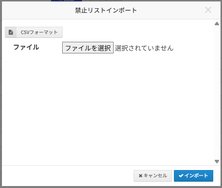
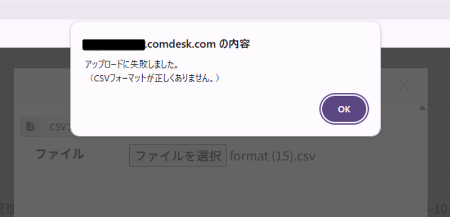

平素より大変お世話になっております。Widsley Supportでございます。

いつもご利用ありがとうございます。

本日（2025/11/05）夜間リリースにて、Comdesk Leadに下記リリースを実施予定でございます。

挙動や仕様において、一部変更となる部分がございますので、ご認識いただけますと幸いです。

——————————————————————————–————————————————–——————–——

### **【Comdesk Lead Web】機能追加・仕様変更**

*   オートコールモード中に対象リスト内の電話番号が「禁止番号」や「未設定」などの理由で\
    架電が止まった際のリストスキップがテナント単位で設定できるようになりました。

    リリース以降は現状の仕様と同様に設定「ON」となっており、架電できない場合はオートコールは止まります。（ON：中断　OFF：スキップ）

    スキップされたい場合は、テナント設定から「OFF」へ変更していただくことで\
    架電が止まったタイミングで画面中央上部にポップアップが表示され、「OK」を押すと次のリストへ架電が進みます。
* IP回線ご利用時に不在着信があった際に、Comdesk Leadにリストが1件のみであれば\
  生成された活動履歴全てに対して顧客名が表示されるようになりました。\
  ※留守番電話や音声ガイダンスは対象外となります。\
  &#x20;
* 活動履歴の条件検索・コール種別にて「未設定」が検索できるようになりました。\
  音声ガイダンスの再生にて作成された活動履歴のアイコンが空欄となるため、「未設定」を選択いただくことで検索が可能となります。
*   禁止リスト管理画面内の禁止番号を一括で追加する場合に\
    「CSVインポート」のポップアップ内に禁止番号インポートフォーマットが設置／ダウンロードできるようになりました。\
    

    ※フォーマットが異なっている場合は、「アップロードに失敗しました。（CSVフォーマットが正しくありません。）」とエラーメッセージが表示されます。

    

### **【Mobile Client】**

* システムログの記録機能を調整しました。

Android端末にて、Mobile Clientをご利用中のお客様に関しましては

・Playストアで「Comdesk Lead」アプリの更新

・Playストア上でアプリの更新ができない場合はアプリをアンインストールし、再インストール

　をお願いいたします。

最新バージョン：1.3.1

操作方法は以下の記事をご参照ください。

・[アンインストール方法](../../機能一覧/基本ガイド/14501428133145_MobileClient_アンインストール.md)

・[インストール方法](../../機能一覧/基本ガイド/14501355033241_MobileClient_インストール.md)

——————————————————————————–————————————————–————————–

リリース日時 ： 2025年11月05日(水）  21：00～26：00頃

※サービスの停止はありません。

——————————————————————————–————————————————–——————–——

以上、ご確認ください。

ご不明点ございましたら、サポート窓口または担当CSまでお気軽にお問い合わせください。

今後も、より一層みなさまのお役に立てるよう取り組んでまいりますので

引き続き、Comdesk Leadのご愛顧を賜りますよう心よりお願い申し上げます。

——————————————————————————–————————————————–——————–——

####
