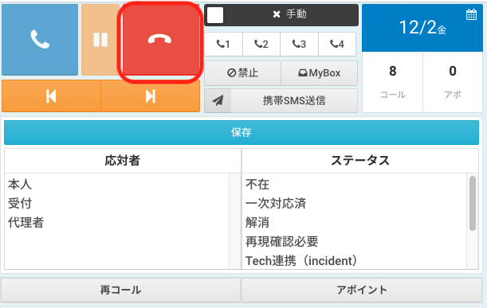
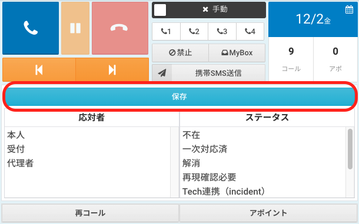
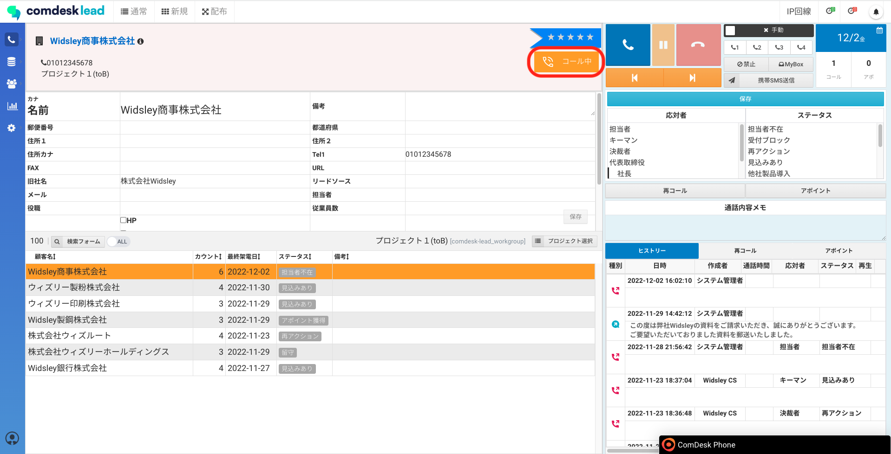
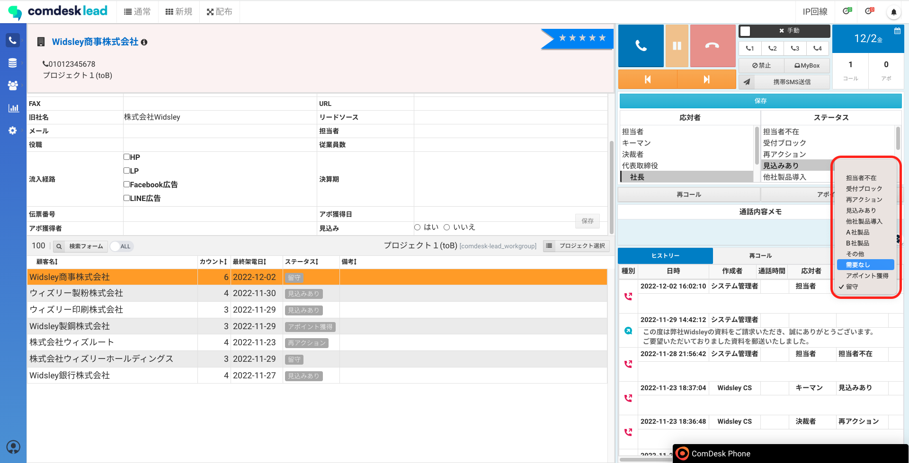
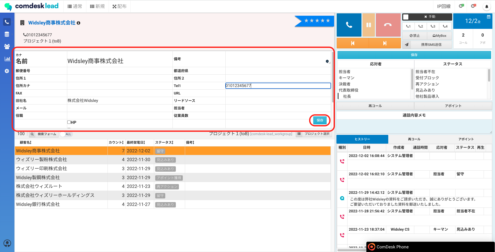

# アクティビティ結果が保存できない

アクティビティ結果が保存できない場合、下記をご確認ください。

## **よくある原因**

* #### **終話ボタンの押し忘れ**

終話ボタンを押し忘れている場合、アクティビティ結果が保存できません。

## 

* #### **「保存」ボタンを連打している（切断時ポップアップが無効の場合）**

「保存」ボタンは**一度だけ**押すようにしてください。\

* #### **インターネットへの接続が切れている**

Wi-Fiをご利用の場合は繋ぎ直す・またはルーターの再起動などをお試しください。

* #### **Comdesk Leadのタブを複数開いて操作している**

Comdesk Leadのタブは1つのみ開いて操作してください。複数のタブでご利用いただくとアクティビティ結果の保存だけでなく、画面の操作が正常に反応しません。

## **保存できなかった際の対処法**

1.  「コール中」の表示が出ていることを確認します\*\*\
    

    \*\*
2.  ヒストリーで直接アクティビティ結果を選択します\
    ※アクティビティ結果の編集にはリーダー以上のユーザー種別が必要※一般ユーザーの方は、ここを飛ばして3へ\*\*\
    

    \*\*
3. 顧客情報を入力し、「保存」をクリックし「コール中」の表示が消えると完了です。\*\*\
   \
   \*\*

その他ご不明点などございましたら、[**サポートチームまでお問い合わせ**](https://comdesklead.zendesk.com/hc/ja/requests/new)をお願い致します。

お問い合わせ方法は\*\*[こちら](../サポートチームへのお問い合わせ方法/12828937533081_サポートチームへのお問い合わせ方法.md)\*\*
