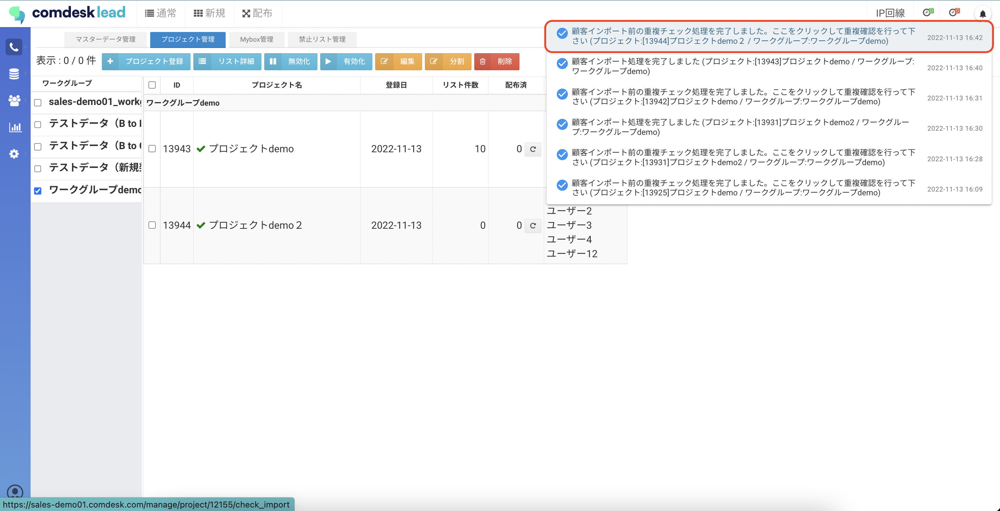
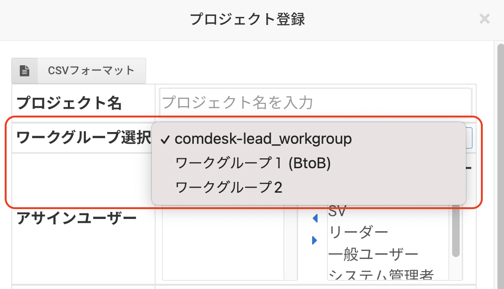
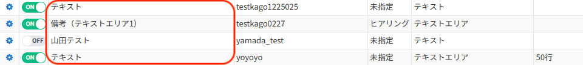

# リストのインポートができない

**目次**\
**チェック1. リストデータ内に不備がある**\
**チ\*\*\*\*ェック2. Tel1〜Tel4に同じ番号が大量にないかを確認する**\
**チェック3. csvデータ内の件数確認**\*\*\
チェック4. csv形式のファイルでインポートを行っているか確認する\*\*\
**チェック5. 連続して複数のcsvをインポートしていないか確認する**\
\*\*チェック6. ワークグループが選択されていることを確認する\
\*\*\*\*チェック7．UUIDが入力済み/空欄が混同しないか確認\
チェック8．リスト項目名が同じもので作成していないか確認する\
\*\*

## **チェック1. リストデータ内に不備がある**

* 禁止文字の入力がないか

,（カンマ）　\
”（半角ダブルコーテーション）\
’（半角シングルコーテーション）\
\`（バッククォート）\
’（全角/半角アポストロフィ）

※旧字体はインポートができても、Comdesk Lead上で正しく表示できない場合があります。

* リスト項目の文字数制限を超えていないか

・カナ：29文字以内

・URL：100文字以内

超えている場合は上記文字数内に修正してください。

* 全ての行に名前入力されているか

名前は必須項目になります。

1つでも空白があるとインポートエラーが出ますので、必ず入力をお願いします。

## **チェック2. Tel1〜Tel4に同じ番号が大量にないかを確認する**

すでにインポートしてあるリストにも同じ番号が大量にある場合、重複チェックで大量にヒットしてしまうので処理が遅くなります。

1000件以上すでに入っている場合は、自動的に処理が中止されます。

（よくある例：番号が不明なため全てのTel1に「0」を入力してインポート）

## **チェック3.csvデータ内の件数確認**

・空のCSVをインポートしてしまうと、インポートエラーとなり**3時間**インポートが行えなくなります。

空のCSVはインポートしないようお願いいたします。

\*\*・\*\*インポートリストが3万件超えていないか

リストインポート件数が目安3万件として推奨になります。

分割して3万件以下でインポートしていただくようお願いします。

## **チェック4. csv形式のファイルでインポートを行っているか確認する**

CSV形式の以外の形式でインポートを行うと、インポートに失敗します。

Excelで作業を行う際は[こちらの記事](../../はじめてガイド/管理者ガイド/16562691982617_CSV形式のファイルをExcelで開く.md)をご参照ください。

## **チェック5.** **連続して複数のcsvをインポートしていないか確認する**

インポートは1つのCSVごとに取り込まれます。\
重複チェックを完了する前に、次のインポートを新たに行った場合、重複チェック処理が溜まって処理が重くなります。\
**必ず1つのCSVファイルをインポートし重複チェックが完了してから次のインポートを行なってください。**

直近の通知が「顧客インポート前の重複チェック処理を完了しました。ここをクリックして重複確認を行って下さい 」というメッセージが出ている場合、重複チェックを行なっていない可能性があります。メッセージをクリックして重複チェックを行ってください。\

## **チェック6.** **ワークグループが選択されていることを確認する**

インポートはワークグループ毎にCSVファイルのフォーマットが異なります。

必ずインポートするCSVファイルのフォーマットとワークグループ選択が一致するようにご選択ください。\

**チェック7．UUIDが入力済み/空欄が混同しないか確認**

行いたいインポート内容によって、UUIDの有無が変わります。

インポート内容については以下ご確認ください。

新しくリストをインポートしたい場合

・UUIDが空欄の状態でリストをインポート

既にあるリストに対して上書きを行いたい場合

・UUIDが入っている状態でインポート

上書きインポートについては[こちら](../../機能一覧/活用ガイド/12819542587929_リストを特定して上書きインポートをする.md)

一つのファイルに新しくインポートするリストとリスト上書きインポートを混同してインポートしないようにお願いします。

**チェック8．リスト項目名（表示ラベル）が同じもので作成していないか確認する**

リスト項目（カスタム項目のみ）が同じ表示ラベルのものがあると、インポートデータがリスト項目のデータが反映されずインポートができない場合があります。

過去に作成した表示ラベルと同じ名称があれば、再度別名称の表示ラベルで作成していただく必要がございます。

リスト項目作成方法については[こちら](../../はじめてガイド/管理者ガイド/12738156781721_リスト項目設定でカスタム項目を作成する.md)

表示ラベル（赤枠）が同じもの例

その他ご不明点などございましたら、[**サポートチームまでお問い合わせ**](https://comdesklead.zendesk.com/hc/ja/requests/new)をお願い致します。

お問い合わせ方法は\*\*[こちら](../サポートチームへのお問い合わせ方法/12828937533081_サポートチームへのお問い合わせ方法.md)\*\*
