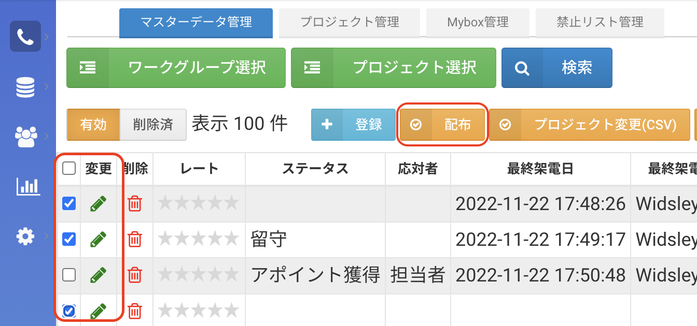
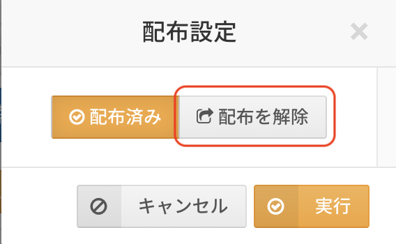
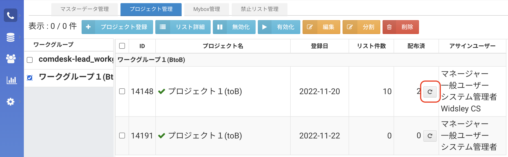
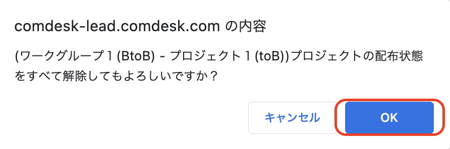

## **概要**

配布し終わったリストを再配布するには、以下2種類の方法があります。

・配布済みリストを未配布のリストへ変更後再配布する

・配布済みプロジェクトごと配布状態を解除後再配布する

目次\
方法1. 配布済みリストを未配布のリストへ変更後再配布する\
方法2. 配布済みプロジェクトごと配布状態を解除後再配布する

## **方法1. 配布済みリストを未配布のリストへ変更後再配布する**

使用例：「不通」となったステータスを検索抽出し、配布解除行ったのち再度自動配布自動配布コールモードで架電する

1.  「マスターデータ管理」からプロジェクトを選択し、\
    再配布したいリストのチェックボックスに✔をつけて、配布ボタンをクリックしてください。

    ※管理者権限を持つアカウントでのみ可能な操作です。

    ※一覧項目の「変更」の横にチェックをつけると全てのリストが選択できます。

    
2. 「配布を解除」したあと、再配布をしてください。\
   

## **方法2. 配布済みプロジェクトごと配布状態を解除後再配布する**

1. 「プロジェクト管理」からワークグループを選択し、再配布したいプロジェクトをの横のリセットボタンを押してください。\
   
2. OKをクリックし配布状態を解除したあと、再配布をしてください。\
   

その他ご不明点などございましたら、[**サポートチームまでお問い合わせ**](https://comdesklead.zendesk.com/hc/ja/requests/new)をお願い致します。

お問い合わせ方法は\*\*[こちら](../サポートチームへのお問い合わせ方法/12828937533081_サポートチームへのお問い合わせ方法.md)\*\*
