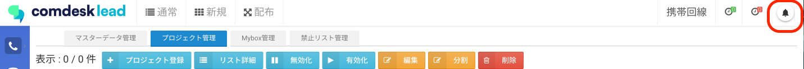
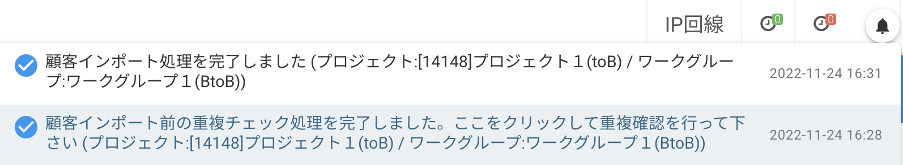
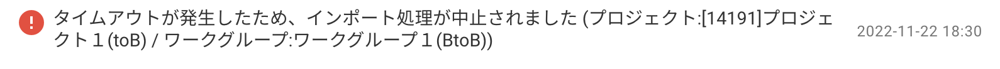

# インポートしたリストが表示されない

インポートしたリストが表示されない場合は、以下の2点をご確認ください。

目次\
[チェック1. インポート完了の通知を確認する](12759146997145_インポートしたリストが表示されない.md)\
[チェック2. インポートにエラーが出ていないか確認する](12759146997145_インポートしたリストが表示されない.md)

## **チェック1.** **インポート完了の通知を確認する**

インポートの完了は画面右上の、通知ボタン（ベルマーク）にて通知します。

通知は以下の２種類です。重複チェックの確認が未対応でないかご確認ください。「顧客インポート処理を完了しました。」の通知後にリストが表示されます。\
インポートのデータ量によって各通知までの所要時間が異なります。

1. 「顧客インポート前の重複チェック処理を完了しました。ここをクリックして重複確認を行って下さい。」\
   ※インポート時に重複チェックをしない設定の場合はこの通知はありません。
2. 「顧客インポート処理を完了しました。」

## **チェック2. インポートにエラーが出ていないか確認する**

インポートしたデータ内容に誤りがある場合、上記同様、通知ボタン（ベルマーク）に下記のような表示が出てきます。今一度、データを確認ください。

（参考）インポートデータへの入力禁止文字の一例です 。\
,（カンマ）　\
”（半角ダブルコーテーション）　\
’（半角シングルコーテーション）\
\`（バッククォート）\
’（全角/半角アポストロフィ）

※旧字体はインポートができても、Comdesk Lead上で正しく表示できない場合があります。

その他ご不明点などございましたら、[**サポートチームまでお問い合わせ**](https://comdesklead.zendesk.com/hc/ja/requests/new)をお願い致します。

お問い合わせ方法は\*\*[こちら](../サポートチームへのお問い合わせ方法/12828937533081_サポートチームへのお問い合わせ方法.md)\*\*
