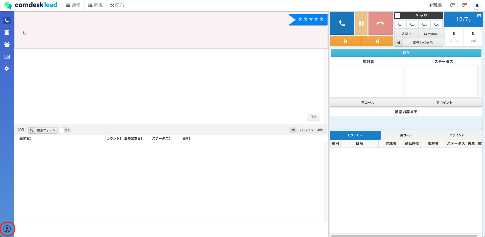
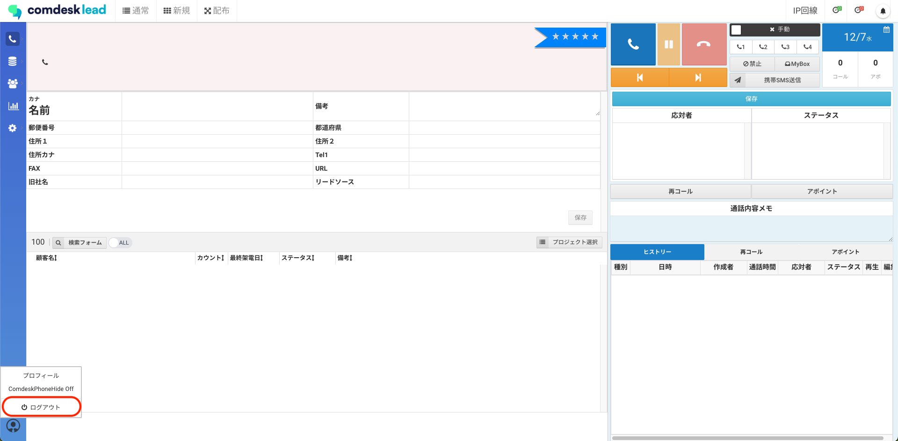

# （統合先の記事確認次第削除）　ログインができない

目次\
チェック1. 「CallServer」アプリの再ログインを行う\
チェック2. Comdesk Leadのログアウト\
チェック3. webブラウザのキャッシュクリア\
チェック4. Comdesk Leadへの再ログイン（[https://login.comdesk.com](https://login.comdesk.com)からログインを行う）

## **チェック1.「CallServer」の再ログインを行う**

**CallServerアプリ**のログアウトをし、再ログインを行ってください。

ログアウト・ログイン：[こちら](../../はじめてガイド/ユーザーガイド/12744354427033_携帯回線発信制御アプリ（CallServer）のログイン・ログアウト.md)をご参照ください。

## **チェック2. Comdesk Leadのログアウト**

Comdesk Leadからログアウトを行ってください。

* Comdesk Leadからのログアウト方法

1. 左下の赤枠内、人柄アイコンをクリックします。\
   
2. 「ログアウト」をクリックするとログアウトできます。\
   

## **チェック3. webブラウザのキャッシュクリア**

webブラウザのキャッシュクリアの方法

1. &#x20;Chrome を開きます。
2. 画面右上のその他アイコンをクリックします。
3. \[その他のツール]\[閲覧履歴を消去] をクリックします。
4. 上部で期間を選択します。すべて削除するには、\[全期間] を選択します。
5. \[Cookie と他のサイトデータ] と \[キャッシュされた画像とファイル] の横にあるチェックボックスをオンにします。
6. \[データを消去] をクリックします。

## **チェック4. Comdesk Leadへ再ログイン（**[**https://login.comdesk.com**](https://login.comdesk.com)**からログインを行う）**

ログイン方法：[こちら](../../はじめてガイド/ユーザーガイド/12735918031513_Comdesk_Leadにログインする.md)をご参照ください。

**※必ずログイン時には**[**login.comdesk.com**](http://login.comdesk.com/)**からログインを行ってください。**\
**Comdesk Leadのタブは必ず1つだけ開いてご利用ください。**

上記を試しても改善されない場合は、

ログインができないユーザーのComdesk Lead ID（メールアドレス型）・パスワードをお控えの上、

[**サポートチームまでお問い合わせ**](https://comdesklead.zendesk.com/hc/ja/requests/new)をお願いいたします。

お問い合わせ方法は[**こちら**](../サポートチームへのお問い合わせ方法/12828937533081_サポートチームへのお問い合わせ方法.md)
