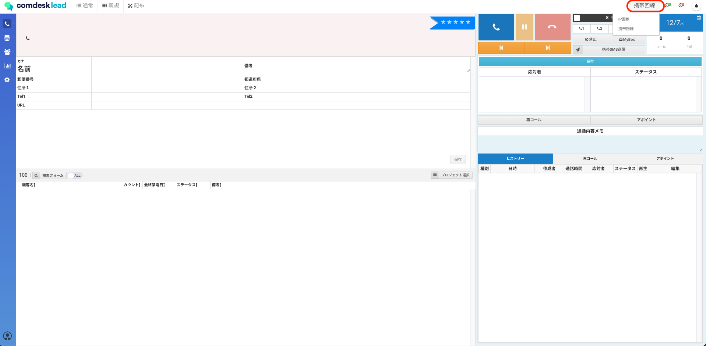

# 「架電に失敗しました」というエラーメッセージが表示された（IP回線ご利用の場合）

目次\
[チェック1. Comdesk Leadからログアウト](13247426326681_「架電に失敗しました」というエラーメッセージが表示された（IP回線ご利用の場合）.md#h_01GMSXRSDGYXHQKEM1VR8V4MG0)\
[チェック2. webブラウザのキャッシュ削除](13247426326681_「架電に失敗しました」というエラーメッセージが表示された（IP回線ご利用の場合）.md#h_01GMSXSN5VVA7CQ3Q74FF30PX6)\
[チェック3. Comdesk Leadへ再ログイン](13247426326681_「架電に失敗しました」というエラーメッセージが表示された（IP回線ご利用の場合）.md#h_01GMSXSVK0K18VJ889CWXJPSP1)\
[チェック4. 回線選択の設定し直し](13247426326681_「架電に失敗しました」というエラーメッセージが表示された（IP回線ご利用の場合）.md#h_01GMSXTDEJTR37D5QECGYD5E2T)\
[チェック5. 架電操作手順の再確認](13247426326681_「架電に失敗しました」というエラーメッセージが表示された（IP回線ご利用の場合）.md#h_01GMSXTM3QCB0GE9J5DR1BDKS9)\
[チェック6. ネットワークの確認](13247426326681_「架電に失敗しました」というエラーメッセージが表示された（IP回線ご利用の場合）.md#h_01GMSY13WSXC018GYQ9HYAF30S)

## **チェック1. Comdesk Leadからログアウト**

Comdesk Leadからログアウトをしてください。

1.  左下の赤枠内、人柄アイコンをクリックします。

    
2.  「ログアウト」をクリックするとログアウトできます。

    

## **チェック2. webブラウザのキャッシュ削除**

1. Chrome を開きます。
2. 画面右上のその他アイコン「︙」をクリックします。
3. 「その他のツール」＞「閲覧履歴を消去」をクリックします。
4. 上部で期間を選択します。すべて削除するには、「全期間」を選択します。
5. 「Cookie と他のサイトデータ」と「キャッシュされた画像とファイル」の横にあるチェックボックスをオンにします。
6. 「データを消去」をクリックします。

## **チェック3. Comdesk Leadへ再ログイン**

ログイン方法：[こちら](../../はじめてガイド/ユーザーガイド/12735918031513_Comdesk_Leadにログインする.md)をご参照ください。

\*\*※必ずログイン時には[login.comdesk.com](http://login.comdesk.com/)からログインを行ってください。\
Comdesk Leadのタブは必ず1つだけ開いてご利用ください。

\*\*

Comdesk Leadにログインする際に最初か最後に**スペース**が入っていないかご確認をお願いいたします。

スペース等がはいっている場合エラーの原因となります。

## **チェック4. 回線選択の設定し直し**

Comdesk Leadへログイン後、赤枠内の回線選択「IP回線」または「携帯回線」をクリックすると\
・IP回線\
・携帯回線　と表示がされますので「IP回線」を選択しなおしてください。

## **チェック5. 架電操作手順の再確認**

架電操作手順：[こちら](../../はじめてガイド/ユーザーガイド/12745769763609_リストに対して架電する.md)をご参照ください。

コールモードごとの架電操作手順が確認できます。

## **チェック6.** **ネットワークの確認**

ネットワークの接続状況をご確認お願いいたします。

・Wi-Fiのルーター再起動

・複数ネットワークがある場合には、ネットワークを切り替え、単数利用とする

・テザリング等でネットワーク環境の変更を行う

上記6点ご確認いただき改善されない場合は

試した内容をご記載の上、\*\*[サポートチーム](https://comdesklead.zendesk.com/hc/ja/requests/new)\*\*までお問い合わせをお願いいたします。

お問い合わせ方法は\*\*[こ](../サポートチームへのお問い合わせ方法/12828937533081_サポートチームへのお問い合わせ方法.md)[ちら](../サポートチームへのお問い合わせ方法/12828937533081_サポートチームへのお問い合わせ方法.md)\*\*
