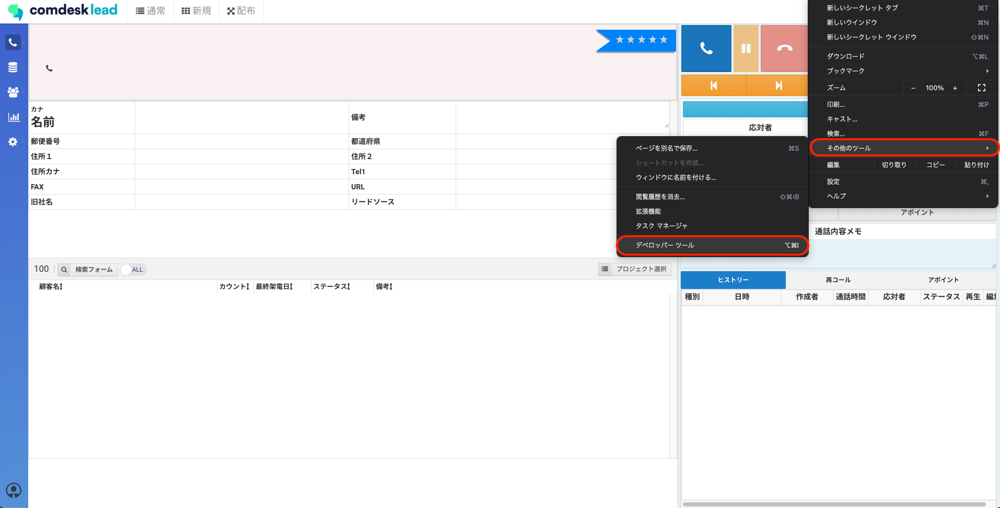
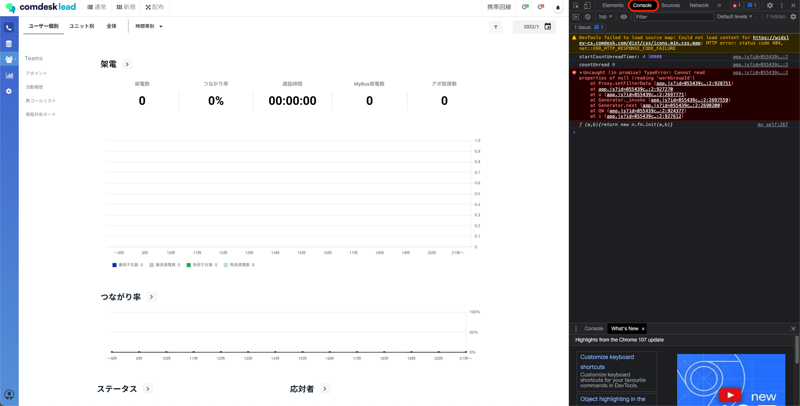
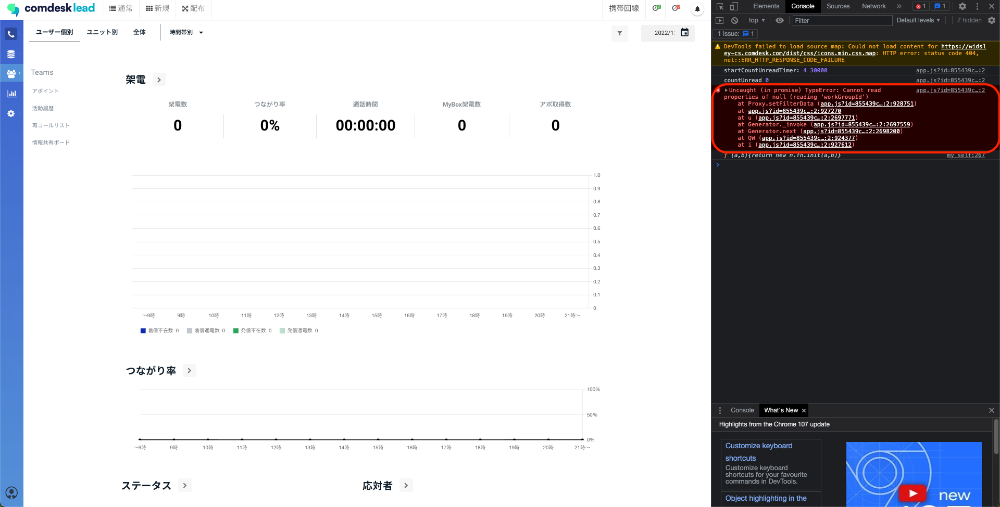
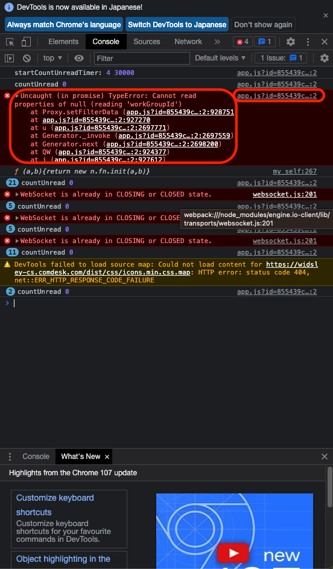

エラーが表示された際、エラーの詳細を把握するためにコンソールログの取得のご協力をお願いすることがございます。

## **コンソールログの取得方法**

1. 不具合の事象を再現させます。
2. ブラウザ右上「︙」をクリックし、「その他のツール」→「デベロッパーツール」をクリックしてください。\
   
3. 右側に表示されているデベロッパーツール内の「Console」タブを選択します。\
   
4.  「Console」タブを開いた状態で不具合が発生する動作を行ってください。\
    エラーが出ると、「Console」タブ内で赤く表示がされます。（以下画像赤枠参照）

    
5. 赤く表示されるエラー内\
   ・左側：エラーのテキスト文\
   ・右側：エラーのURL\
   をそれぞれテキストでご共有をお願いいたします。\
   
6. エラーの詳細を開発チームで確認させていただきます。

コンソールログの取得ができましたら、サポートチームへ共有をお願いいたします。

その他ご不明点などございましたら、[**サポートチームまでお問い合わせ**](https://comdesklead.zendesk.com/hc/ja/requests/new)をお願い致します。

お問い合わせ方法は\*\*[こちら](../サポートチームへのお問い合わせ方法/12828937533081_サポートチームへのお問い合わせ方法.md)\*\*
