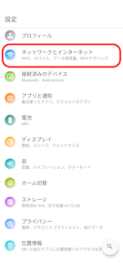
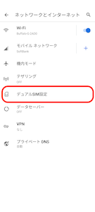
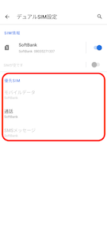

# 携帯回線で架電時にsim選択の画面が表示される

携帯回線で架電時に、\*\*「SIMを選択してください」\*\*とポップアップが表示され、

架電が出来ない際の解消方法をご説明します。

※利用端末がDIGNO BX2の端末をご利用の場合のみポップアップが表示される可能性があります。

▼解消手順

1. 携帯端末の「設定」を開いてください。
2. 「ネットワークとインターネット」を開きます。\
   
3. 「デュアルSIM設定」を開きます。\
   
4. 赤枠の優先SIM内\
   ・モバイルデータ\
   ・通信\
   ・SMSメッセージ\
   全てがSoftbankになっているか確認してください。\
   ※「毎回選択する」と表示されている場合、「SIMを選択してください」のポップアップが表示されます。\
   
5. Comdesk Leadを開き、テスト架電を行ってください。\
   コール画面で発信ボタンをクリックすると端末側に「SIMを選択してください」とポップアップが表示されます。
6. **先に「この設定を記憶する」にチェックを入れた**上で、Softbankの番号をクリックします。
7.  設定が完了すると、今後SIM選択のポップアップは表示されず\
    Softbankの番号が常に優先される状態になります。

    その他ご不明点などございましたら、[**サポートチームまでお問い合わせ**](https://comdesklead.zendesk.com/hc/ja/requests/new)をお願いいたします。

    お問い合わせ方法は\*\*[こちら](../サポートチームへのお問い合わせ方法/12828937533081_サポートチームへのお問い合わせ方法.md)\*\*
