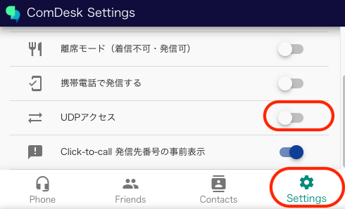
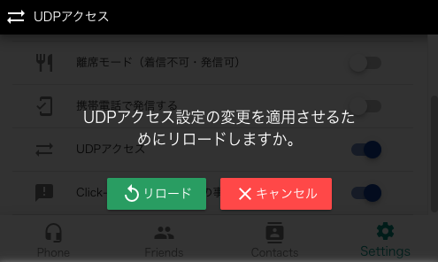
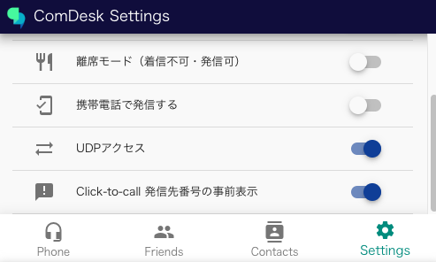

# 通話時にノイズが入ったり、途切れたりする（IP回線）

IP回線で音声が聞き取りづらい・途切れるという場合の確認事項をご紹介します。

[活動履歴で音声ログを確認](14868042438809_通話時にノイズが入ったり、途切れたりする（IP回線）.md#h_01GQKSA9297BJ0TMEQ7FR829HZ)\
[ネットワークの確認](14868042438809_通話時にノイズが入ったり、途切れたりする（IP回線）.md#h_01GQKSAH4975PQT79C1SPSX6N7)\
[ヘッドセットの相性](14868042438809_通話時にノイズが入ったり、途切れたりする（IP回線）.md#h_01GQKSAQ1Q8EQ6B5ADS503HFGF)\
[マイクに近すぎる](14868042438809_通話時にノイズが入ったり、途切れたりする（IP回線）.md#h_01GQKSAWHA0HMKCGX7C2HJ2G29)\
[PCのサウンド設定](14868042438809_通話時にノイズが入ったり、途切れたりする（IP回線）.md#h_01GQKSB212K8S4X4SJ5BZ1RBKD)\
[UDPアクセスをオンにする](14868042438809_通話時にノイズが入ったり、途切れたりする（IP回線）.md#h_01GRNMRSECQE0207BBSEKEWBRS)

## **活動履歴で音声ログを確認**

活動履歴から音声ログを確認し、ノイズや音声が途切れたりしているか確認します。

## **ネットワークの確認**

Wi-Fi またはネットワークのパフォーマンスを改善する

・他のネットワーク環境がある場合、ネットワークを変更する

・ネットをテザリングに変更する（4G→5Gへの切り替え）

ネットワークを改善することで改善する場合があります。

## **ヘッドセットの相性**

Bluetoothのヘッドセットではなく、有線タイプのヘッドセットを推奨します。

（電波が混線してしまうため影響を受けやすくなります）

## **マイクに近すぎる**

マイクと口元が近い場合、吐息が入ってしまうと電話先が聞こえづらくなる場合があります。

マイクと口元の位置をご調整してみてください。

## **PCのサウンド設定**

ノイズキャンセリング付きヘッドセットをご使用の場合、ノイズキャンセリングの感度が効きすぎてしまい、自身の声もノイズとして判断されてる場合があります。

感度の調整を推奨します。

音声聞こえない・マイクが入らない場合は設定をご確認ください。

＜設定方法＞

（Windows）設定>システム>サウンド>音量ミキサー>アプリ>出力デバイス・入力デバイスを対象のヘッドセットを選択

## **UDPアクセスをオンにする**

ルーター配下に他のルーターやルーティング機能を持つスイッチ、アクセスポイントなど機器を配置されていることで多重NATになっている場合は、音声の通信が不安定になる可能性があります。

（多重NATの例：マンションの共用部ルーターと宅内ルーターが設置されていることで二重ルーター状態になっている、等）

通常Comdesk LeadはTCPアクセスがデフォルトとなっていますが、上記の環境の場合、UDPアクセスに切り替えることで通信状態が改善する場合があります。

ComDesk PhoneのSettingを開きます。

UDPアクセスをONにするとリロードを求められます。

リロードを行い、UDPアクセスがオンになっているのを確認します。

その他ご不明点などございましたら、[**サポートチームまでお問い合わせ**](https://comdesklead.zendesk.com/hc/ja/requests/new)をお願いいたします。

お問い合わせ方法は\*\*[こちら](../サポートチームへのお問い合わせ方法/12828937533081_サポートチームへのお問い合わせ方法.md)\*\*
