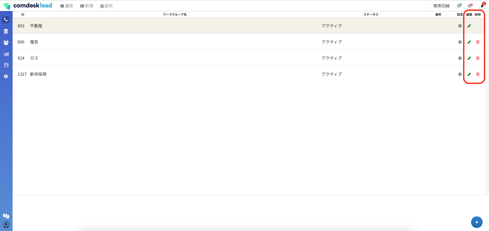

# ワークグループが削除できない

一度でもプロジェクトが所属した履歴のあるワークグループは、そのワークグループ内の全てのプロジェクトを削除してもそのワークグループは削除ができない仕様となっております。

ワークグループ管理画面上では「削除」のゴミ箱のアイコンが表示されておりますが、クリックしても”\_エラーが発生しました”という\_エラーメッセージが表示されるだけとなっておりますのでご了承ください。

また、テナントご提供時にデフォルトで設定されている、一番上のワークグループも削除できません。

ワークグループの名前は、「編集」のペンのアイコンから変更可能ですので、使用しないワークグループと分かるようなワークグループ名に変更し運用してください。

その他ご不明点などございましたら、[**サポートチームまでお問い合わせ**](https://comdesklead.zendesk.com/hc/ja/requests/new)をお願い致します。

お問い合わせ方法は\*\*[こちら](../サポートチームへのお問い合わせ方法/12828937533081_サポートチームへのお問い合わせ方法.md)\*\*
