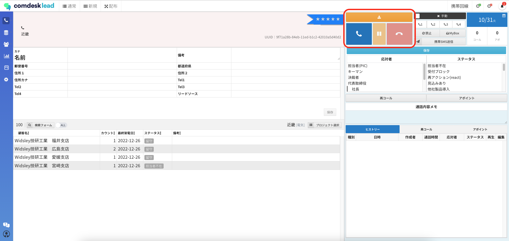
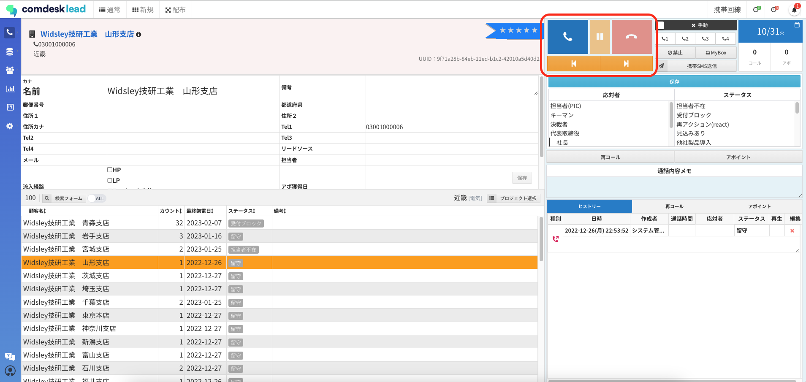

## **原因**

同一プロジェクト内で、「配布コールモード」での架電と「通常コールモード」での架電が混在してしまっていると考えられます。

## **配布コールモードと通常コールモードの違い**

・**配布コールモード**：複数の担当者で同一プロジェクトに架電する際に利用。プロジェクトからユーザーが配布を受けて架電する。

・**通常コールモード**：選択したプロジェクトにあるリストに架電する。

上記の違いがあるため、同一プロジェクト内で2つの架電方法が混在すると、表示されるリストが重複することになります。\
配布コールモードで架電する場合は、そのプロジェクトにアサインされている全員が配布コールモードで架電できているかご確認ください。

画面右側の表示が違います。

（配布コールモードの画面）\

（通常コールモードの画面）\

その他ご不明点などございましたら、[**サポートチームまでお問い合わせ**](https://comdesklead.zendesk.com/hc/ja/requests/new)をお願い致します。

お問い合わせ方法は\*\*[こちら](../サポートチームへのお問い合わせ方法/12828937533081_サポートチームへのお問い合わせ方法.md)\*\*
