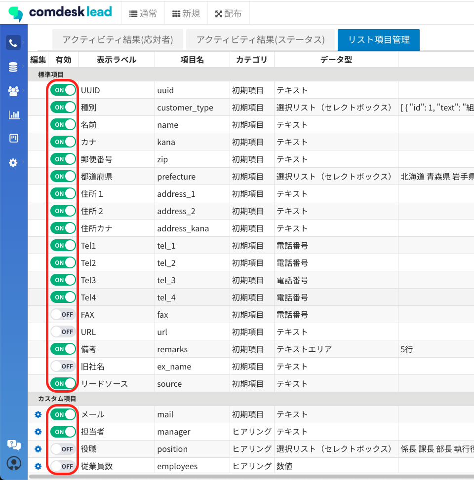
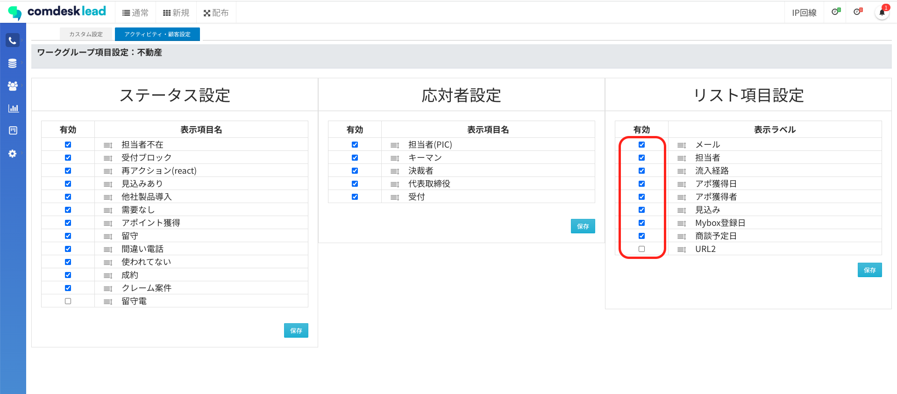
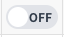

# 【作成中】リスト項目がコール画面で表示されない

## **原因**

* 「リスト項目設定」で対象の項目がOFFになっている\
  
* 「ワークグループ管理」内にある各ワークグループの「設定」で、対象の項目が有効になっていない\*\*\
  \
  \*\*

## **解決方法**

* 「リスト項目設定」で対象の項目がをONに変更\
  （OFF状態）\
  \
  　  ⬇︎\
  （ON状態）\
  
* 「ワークグループ管理」内にある各ワークグループの「設定」で、対象の項目にチェックを入れ「保存」をクリック\
  （無効状態）\
  \
  &#x20;   ⬇︎\
  （有効状態）\
  &#x20;\
  &#x20;   ⬇︎\
  （保存ボタン）\
  

その他ご不明点などございましたら、[**サポートチームまでお問い合わせ**](https://comdesklead.zendesk.com/hc/ja/requests/new)をお願い致します。

お問い合わせ方法は\*\*[こちら](../サポートチームへのお問い合わせ方法/12828937533081_サポートチームへのお問い合わせ方法.md)\*\*
