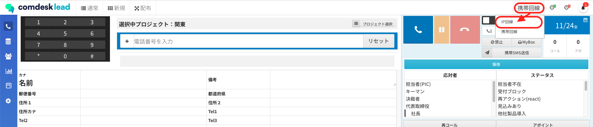
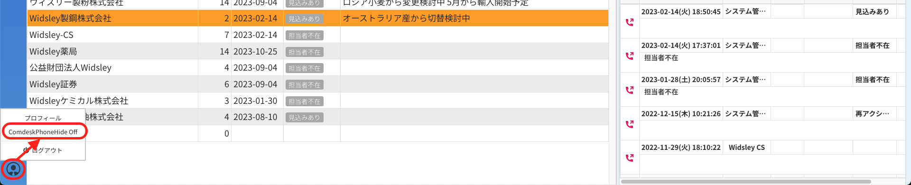

## **原因**

* IP回線が選択されていない
* Comdesk Phoneが非表示の設定になっている

## **解決方法**

* 画面右上で「回線選択」「携帯回線」のどちらかが表示されている箇所をクリックし、IP回線を選択する\
  
*   画面左下の人型アイコンをクリックし、「ComdeskPhone Hide Off」を選択する\
    

    その他ご不明点などございましたら、[**サポートチームまでお問い合わせ**](https://comdesklead.zendesk.com/hc/ja/requests/new)をお願い致します。

    お問い合わせ方法は\*\*[こちら](../サポートチームへのお問い合わせ方法/12828937533081_サポートチームへのお問い合わせ方法.md)\*\*
