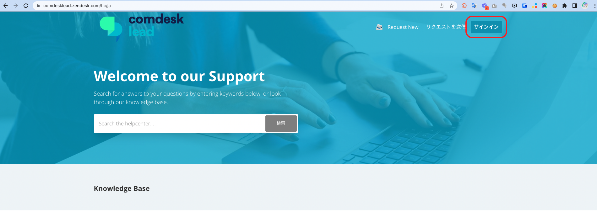
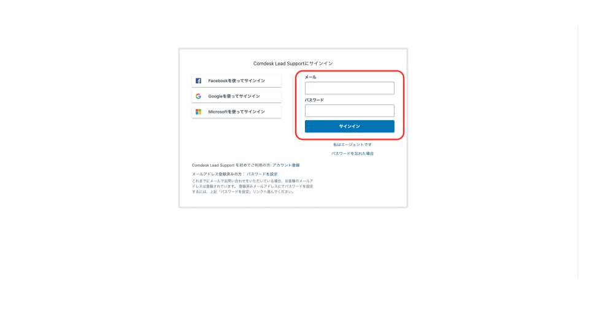
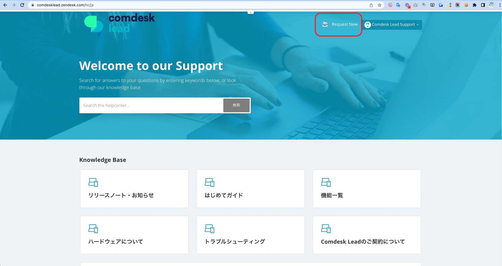
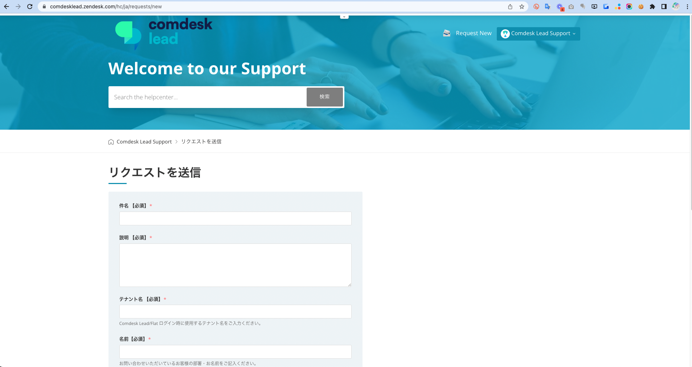
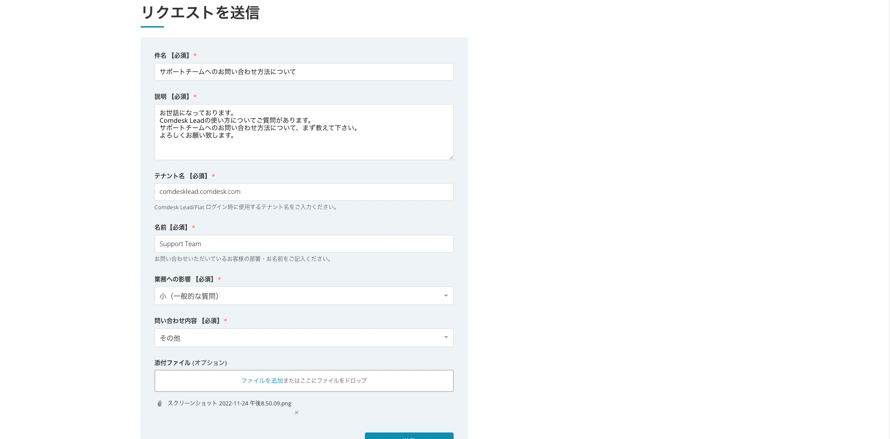
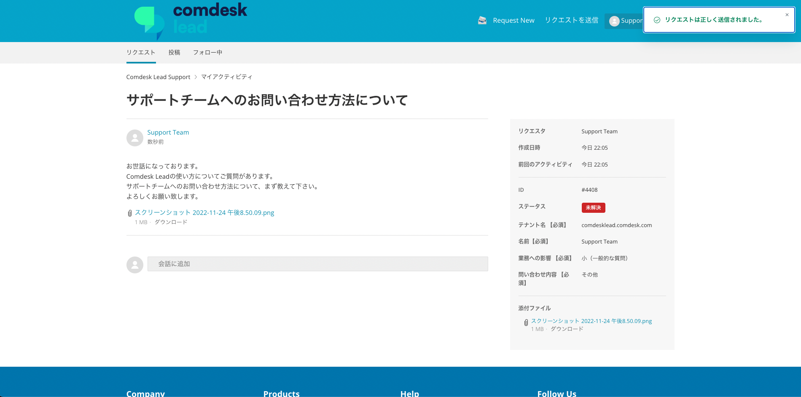
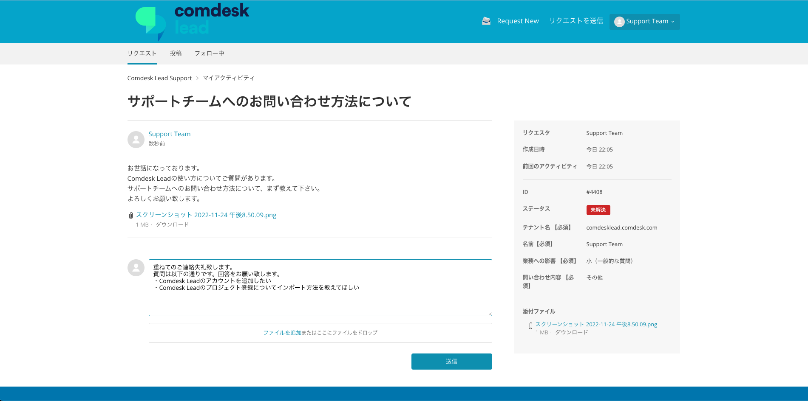
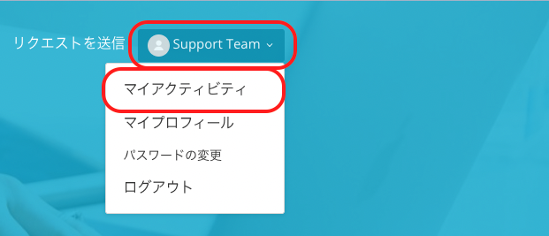
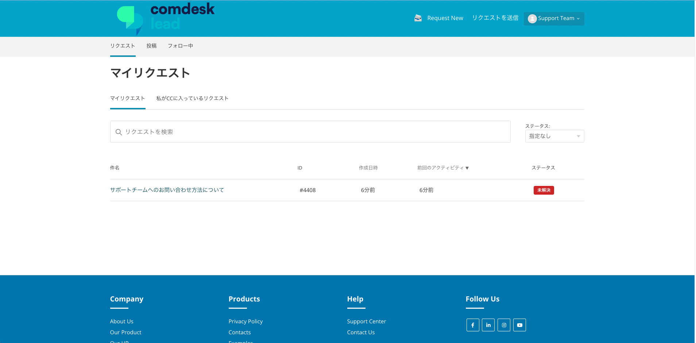

本記事では、弊社サポートチームへのお問い合わせ方法をご案内します。

サービスに関するご質問やご要望がございましたら、以下手順にて、\*\*「リクエストを送信」\*\*フォームより、お問い合わせをお願いいたします。

目次\
1\. ログイン\
　　　2回目以降のログイン　1〜2\
2\. リクエスト送信（フォーム入力）　1〜2\
3\. リクエスト送信後の確認\
4\. マイアクティビティの確認　1〜3

**1. ログイン**

まず、\*\*[ヘルプセンター](https://comdesklead.zendesk.com/hc/ja)\*\*へアクセスします。

　→　はじめてログインされる方は[こちらの記事](12927370479257_はじめてのサポートチームへのお問い合わせ方法.md)をご確認ください。

　→　2回目以降でログインされる方は本記事をご覧ください。

**2回目以降のログイン**

1\. 以下を入力し、「サインイン」をクリックしてください。

・メール

・パスワード\

2\. ログインが完了します。

**2. リクエスト送信（フォーム入力）**

2-1. 「[**Request New**](https://comdesklead.zendesk.com/hc/ja/requests/new)」をクリックしてください。

2-2. 以下の通り、フォームをご入力ください。

1. 「件名」欄に、タイトルをご入力ください。
2. 「説明」欄に、具体的なご質問やリクエスト内容をご入力ください。
3. 「担当者名のお名前」欄に、ご担当者様のお名前をご入力ください。
4. 「添付ファイル」（オプション）欄に、必要に応じて、ファイルや画像（スクリーンショット）などを添付してください。
5. 最後に「送信」ボタンをクリックしてください。

→下記項目をより具体的にご記入いただきますと、迅速な対応に繋がります。ご協力ください。

・該当テナント名（〇〇.comdesk.com） ・事象内容 ・発生日時 ・再現方法、動作手順 ・影響範囲、対象ユーザー\
・ご利用ネットワーク環境\
・解決のために試してみた内容

送信いただいた内容に応じて、弊社サポートチームがご担当者様にご返答致します。

**3. リクエスト送信後の確認**

フォーム送信後に、以下の画面が表示されます。

以下の方法で、当該リクエストに関するやり取りが可能となります。

・メール

・「会話に追加」

## **4. マイアクティビティの確認**

4-1. ログイン中のアカウント名をクリックしてください。

4-2. プルダウンメニューより、「マイアクティビティ」を選択してください。

4-3. リクエスト一覧（「マイリクエスト」）が表示されますので、こちらの画面でこれまでのリクエスト送信の内容をご確認ください。\

その他ご不明点などございましたら、[**サポートチームまでお問い合わせ**](https://comdesklead.zendesk.com/hc/ja/requests/new)をお願い致します。

本記事のリクエスト方法についてご不明点がございましたら、以下までお気軽にご連絡くださいませ。

・Support E-mail：cs@widsley.com

・Support Tel：03-6327-2771
