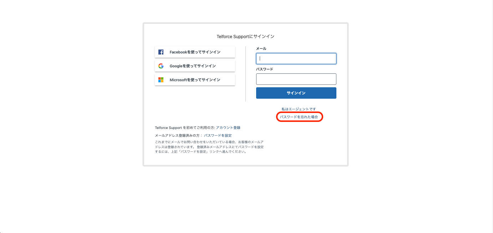
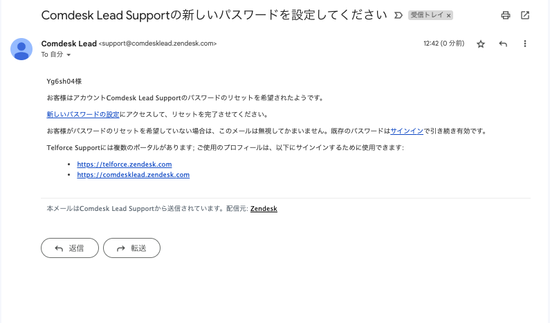

# ヘルプセンターログイン時のパスワードを忘れてしまった

ヘルプセンターログイン時のパスワードを忘れてしまった際の再設定方法についてご説明します。

1. 赤枠「パスワードを忘れた場合」をクリックします。\
   
2. パスワードを再設定したいメールアドレスを入力し送信します。\
   
3. 登録しているメールアドレス宛にパスワード再設定のメールが届きます。\
   メールのURLより、パスワードの再設定を行ってください。\
   
4. 再設定後、メールアドレスと再設定したパスワードでログインを行ってください。

その他ご不明点などございましたら、[**サポートチームまでお問い合わせ**](https://comdesklead.zendesk.com/hc/ja/requests/new)をお願い致します。

お問い合わせ方法は\*\*[こちら](12828937533081_サポートチームへのお問い合わせ方法.md)\*\*
