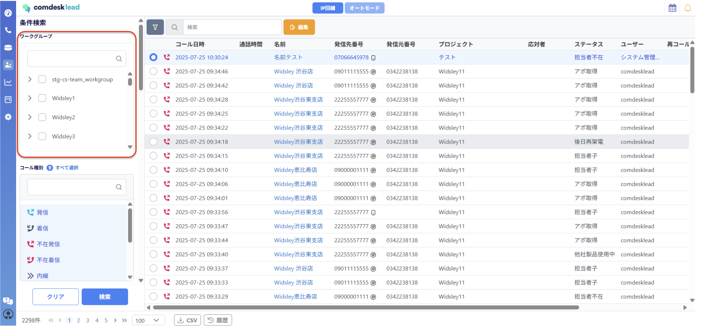
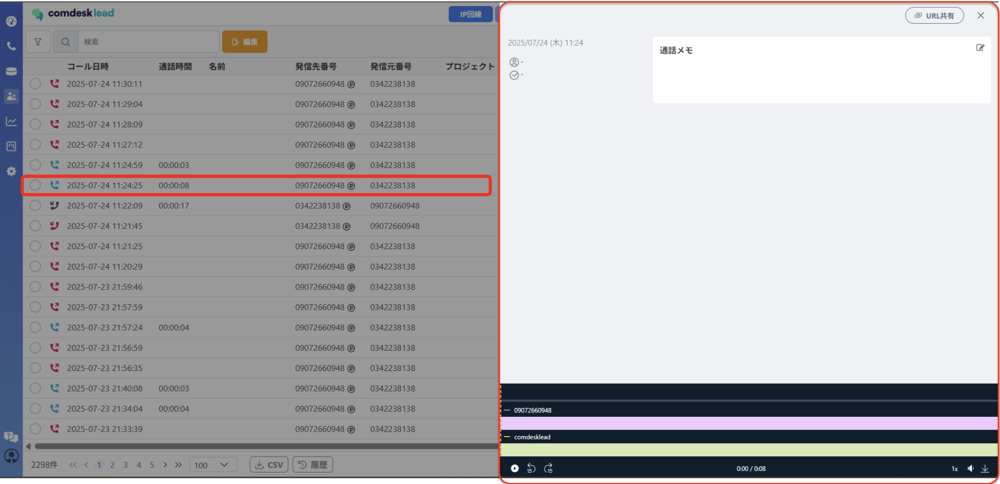
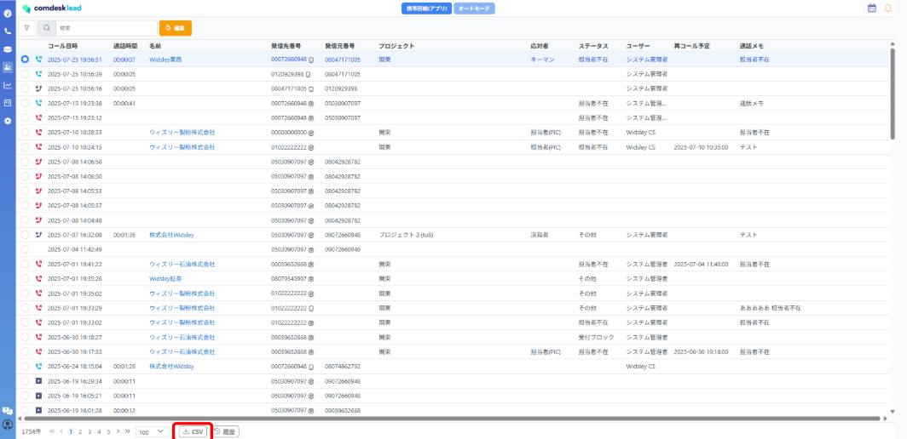

# 活動履歴で通話履歴を確認する

## **活動履歴の閲覧**

1.  画面左側のTeamsアイコンを選択し、活動履歴を選択してください。  
      
    
2.  活動履歴一覧画面が表示されます。  
      
    
3.  ワークグループ、プロジェクト、ステータスなど特定の活動履歴を検索できます。下図は、ワークグループの検索例です。①ワークグループを選択します。②チェックボックスをONにしてワークグループを選択し、「適用」ボタンを選択します。活動履歴の検索方法は[こちら](../../リリースノート・お知らせ/Comdesk_Lead_Release_Notes/33340552647705_活動履歴の表示と検索方法（アップデート後）.md)

## **通話録音データの再生/ダウンロード**

ユーザーが架電した通話の録音を再生/ダウンロードできます。

※IP回線ご利用の場合：通話終了後まもなく反映されます。

※携帯回線ご利用の場合：通話終了から録音があがるまでに10分〜1時間程度のタイムラグがございます。

1.  ①活動履歴一覧のうち1件を選択します。②画面右側に詳細画面が表示されます。  
      
    

## **活動履歴のCSVダウンロード**

1.  画面下部のCSVダウンロードアイコンを選択すると、活動履歴をCSV形式でダウンロードできます。より詳細な分析等にお使いください。

その他ご不明点などございましたら、[**サポートチームまでお問い合わせ**](https://comdesklead.zendesk.com/hc/ja/requests/new)をお願い致します。

お問い合わせ方法は**[こちら](../../トラブルシューティング/サポートチームへのお問い合わせ方法/12828937533081_サポートチームへのお問い合わせ方法.md)**
